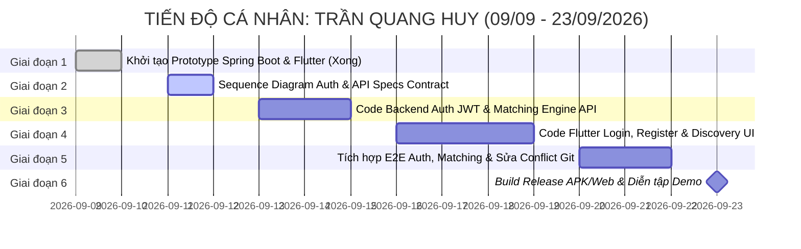

# 📋 BẢNG PHÂN CÔNG NHIỆM VỤ CÁ NHÂN CHI TIẾT: TRẦN QUANG HUY

> **Họ và tên**: **Trần Quang Huy**  
> **Mã số sinh viên (MSSV)**: **24110228**  
> **Vai trò nòng cốt**: **Main Fullstack Developer** *(Lập trình viên chính tham gia toàn bộ vòng đời SDLC)*  
> **Mảng Kỹ thuật Phụ trách Đầu mối (Lead)**: **Lead Kiến trúc Kỹ thuật & Prototype (Technical & Architecture Lead)**  
> **Dự án**: Nền tảng Tìm bạn cùng thuê trọ và Ghép bạn trọ theo tiêu chí (Roommate Matching Hub)  
> **Công nghệ thực hiện**: Java 21 Spring Boot 3 (Backend) + Flutter Dart (Frontend) + MySQL 8.0  
> **Thời gian thực hiện**: **09/09/2026 – 23/09/2026** (14 ngày / 2 tuần)  
> **HẠN CHÓT BÀN GIAO TOÀN DIỆN (HARD DEADLINE)**: ⏰ **18:00 Thứ Tư, ngày 23/09/2026**

---

## 🎯 1. TỔNG QUAN PHẠM VI TRÁCH NHIỆM (SCOPE OF WORK)

| Phân hệ đảm nhiệm | File / Module cụ thể | Nhiệm vụ chính |
| :--- | :--- | :--- |
| **Backend (Spring Boot 3)** | `controller/AuthController.java`<br>`service/AuthService.java`<br>`config/SecurityConfig.java`<br>`config/JwtUtils.java`<br>`controller/MatchController.java`<br>`service/MatchingService.java`<br>`dto/MatchRecommendationDTO.java`<br>`dto/MatchCriteriaDetailDTO.java` | Xây dựng hệ thống bảo mật & phân quyền JWT (Đăng ký, Đăng nhập, Cấp token, Phân quyền endpoint). Lập trình **Lõi Thuật toán Gợi ý Ghép đôi (`MatchingService`)** tính toán % tương thích có trọng số theo tiêu chí 5 chiều. |
| **Frontend (Flutter Client)** | `screens/login_screen.dart`<br>`screens/home_screen.dart`<br>`widgets/match_card.dart`<br>`models/match_recommendation.dart`<br>`services/api_service.dart` | Thiết lập kiến trúc mạng (`api_service.dart` đính kèm Token), Màn hình Đăng nhập/Đăng ký với validation, Màn hình Khám phá bạn trọ (Discovery Feed) hiển thị thẻ ứng viên kèm % Match và bảng đối chiếu tiêu chí. |
| **Lead Technical & DevOps** | `docs/API_SPECIFICATION.md`<br>`docs/diagrams/sequences/`<br>`build/app/outputs/flutter-apk/`<br>`build/web/` | Chủ trì xây dựng tài liệu chuẩn REST API Specification (OpenAPI/Swagger), vẽ Sequence Diagram luồng Auth & Matching, hỗ trợ gỡ lỗi kỹ thuật/xung đột Git cho nhóm, đóng gói bản phát hành APK và Web. |

---

## 📅 2. BẢNG TIẾN ĐỘ VÀ DEADLINE TỪNG MỐC CỦA QUANG HUY



---

## 📝 3. NHIỆM VỤ ĐI SÂU CHI TIẾT TỪNG GIAI ĐOẠN (STEP-BY-STEP DEEP TASKS)

---

### GIAI ĐOẠN 1: THIẾT LẬP NỀN TẢNG PROTOTYPE (09/09 – 10/09/2026)
*Trạng thái: ✅ ĐÃ HOÀN THÀNH XUẤT SẮC*

- [x] **Task QH2-1.1: Khởi tạo khung Backend Java Spring Boot 3 (`backend/`)**  
  - *Kết quả*: Cấu hình JDK 21, Spring Data JPA, Spring Security, MySQL Connector, Maven wrapper hoạt động trơn tru.
- [x] **Task QH2-1.2: Khởi tạo khung ứng dụng đa nền tảng Flutter (`frontend/`)**  
  - *Kết quả*: Cấu hình `pubspec.yaml`, HTTP client, Routing cơ bản cho Web và Mobile.
- [x] **Task QH2-1.3: Dọn dẹp triệt để xung đột bộ đọc giải pháp .NET của VS Code**  
  - *Kết quả*: Thiết lập file `.vscode/settings.json` với `"dotnet.projects.autoLoad": false`.

---

### GIAI ĐOẠN 2: THIẾT KẾ KIẾN TRÚC & CHUẨN HÓA API CONTRACTS (11/09 – 12/09/2026)
*Mục tiêu giai đoạn: Thiết kế luồng xử lý JWT, kiến trúc thuật toán Matching và ban hành tài liệu đặc tả API dùng chung.*  
*Hạn chót toàn giai đoạn 2: ⏰ **23:59 Thứ Bảy, 12/09/2026***  
*Nhánh Git thực hiện*: `docs/architecture-specs`

#### 📌 Task QH2-2.1: Thiết kế Sequence Diagram luồng Xác thực JWT & Thuật toán Matching [x] (✅ ĐÃ NGHIỆM THU 11/09/2026)
- **Thời hạn hoàn thành**: ⏰ **18:00 Thứ Sáu, 11/09/2026** — *Hoàn thành đúng hạn!*
- **Nhiệm vụ cụ thể**:
  - Dùng Draw.io / PlantUML thiết kế 2 sơ đồ tuần tự (Sequence Diagram) cấp hệ thống:
    1. *Sơ đồ 1 - Chu trình Xác thực Token JWT*:
       - `Flutter Client` gửi `POST /api/v1/auth/login` (email, password).
       - `AuthController` tiếp nhận -> chuyển sang `AuthenticationManager` kiểm tra hash password BCrypt trong MySQL.
       - Nếu đúng, `JwtUtils` tạo chuỗi `access_token` (ký khóa bí mật HMAC-SHA256, thời hạn 24h) và `refresh_token` (thời hạn 7 ngày).
       - Client nhận chuỗi token -> lưu vào bộ nhớ an toàn (`SharedPreferences` / `FlutterSecureStorage`).
       - Với mỗi request tiếp theo: Client đính kèm Header `Authorization: Bearer <access_token>`.
       - `JwtAuthenticationFilter` chặn request -> kiểm tra tính hợp lệ -> trích xuất `userId` và cấp quyền vào `SecurityContextHolder`.
    2. *Sơ đồ 2 - Chu trình Lõi Thuật toán Matching*:
       - `Flutter Client` gửi `GET /api/v1/matching/recommendations` (kèm Bearer Token).
       - `MatchingService` lấy `UserPreference` của user đăng nhập.
       - Truy vấn tất cả ứng viên khác trong hệ thống có trạng thái `ACTIVE` (loại trừ chính mình và các user đã ghép/từ chối trước đó).
       - Tính toán độ tương thích theo công thức chuẩn hóa 5 chiều.
       - Sắp xếp danh sách theo điểm số giảm dần và trả về danh sách `MatchRecommendationDTO`.
- **Đầu ra**: 2 file ảnh PNG lưu tại `docs/diagrams/sequences/` (`seq_jwt_auth.png`, `seq_matching_engine.png`).
- **Bàn giao chéo**: Gửi cho Quốc Huy để chèn vào báo cáo học thuật [`Nhom13_Mohinhhoayeucau.docx`](docs/Nhom13_Mohinhhoayeucau.docx).

#### 📌 Task QH2-2.2: Ban hành Tài liệu Đặc tả Chuẩn REST API Specifications (API Contract)
- **Thời hạn hoàn thành**: ⏰ **18:00 Thứ Bảy, 12/09/2026**
- **Nhiệm vụ cụ thể**:
  - Soạn file tài liệu Markdown `docs/API_SPECIFICATION.md` định nghĩa toàn bộ 25+ endpoints của dự án:
    - Định dạng Response bao bọc chuẩn (Generic API Response wrapper):
      ```json
      {
        "status": 200,
        "message": "Thao tác thành công",
        "data": { ... }
      }
      ```
    - Quy ước mã lỗi chuẩn HTTP:
      - `400 Bad Request`: Thiếu trường dữ liệu, validation thất bại.
      - `401 Unauthorized`: Token không hợp lệ, chưa đăng nhập.
      - `403 Forbidden`: Không có quyền truy cập (User thường gọi Admin).
      - `404 Not Found`: Không tìm thấy thực thể (ID không tồn tại).
      - `409 Conflict`: Trùng lặp (Email đã đăng ký, đã gửi lời mời trước đó).
  - Định nghĩa chi tiết Schema Request/Response cho nhóm Auth và Matching.
- **Đầu ra**: File `docs/API_SPECIFICATION.md`. Bàn giao trực tiếp cho Quốc Huy và Tiến Đạt để code Backend khớp 100% với Frontend.

#### 📌 Task QH2-2.3: Chuẩn hóa Kiến trúc HTTP Client & Token Interceptor trong Flutter
- **Thời hạn hoàn thành**: ⏰ **23:59 Thứ Bảy, 12/09/2026**
- **Nhiệm vụ cụ thể**:
  - Mở file `frontend/lib/services/api_service.dart`:
    - Tạo biến lưu trữ token tập trung: `String? _token;`.
    - Viết hàm `setAuthToken(String token)` và `clearAuthToken()`.
    - Viết cơ chế tự động gắn header `Authorization: Bearer $_token` cho mọi request gọi đi.
    - Bắt lỗi 401 toàn cục: Nếu server trả về 401 thì tự động chuyển hướng màn hình về `login_screen.dart` và thông báo "Phiên làm việc đã hết hạn".
- **Đầu ra**: File `api_service.dart` hoàn thiện sẵn sàng cho các màn hình sử dụng.

---

### GIAI ĐOẠN 3: LẬP TRÌNH BACKEND SPRING BOOT 3 (13/09 – 15/09/2026)
*Mục tiêu giai đoạn: Hoàn thiện bảo mật Spring Security 6 với JWT và cài đặt thuật toán tính điểm tương thích Matching.*  
*Hạn chót toàn giai đoạn 3: ⏰ **23:59 Thứ Hai, 15/09/2026***  
*Nhánh Git thực hiện*: `feature/auth-matching-backend`

#### 📌 Task QH2-3.1: Lập trình Module Bảo mật Xác thực JWT (`AuthController` & `SecurityConfig`)
- **Thời hạn hoàn thành**: ⏰ **18:00 Chủ Nhật, 14/09/2026**
- **Các file cần chỉnh sửa / tạo mới**:
  - `backend/src/main/java/com/roommate/hub/config/SecurityConfig.java`:
    - Cấu hình `SecurityFilterChain`:
      - Cho phép tự do (Permit All): `/api/v1/auth/**`, `/v3/api-docs/**`, `/swagger-ui/**`.
      - Yêu cầu Role Admin: `/api/v1/admin/**`.
      - Tất cả các endpoint khác yêu cầu `Authenticated`.
    - Cấu hình CORS Filter cho phép Frontend Flutter Web gọi qua cổng 8080 không bị block.
    - Cung cấp Bean `PasswordEncoder` sử dụng `BCryptPasswordEncoder`.
  - `backend/src/main/java/com/roommate/hub/config/JwtUtils.java`:
    - Hàm `generateAccessToken(User user)`: Ký JWT chứa `userId`, `email`, `role`, thời hạn sống 86.400.000 ms (24h).
    - Hàm `validateJwtToken(String authToken)`: Kiểm tra tính toàn vẹn và thời hạn của token.
    - Hàm `getUserIdFromJwtToken(String token)`.
  - `backend/src/main/java/com/roommate/hub/service/AuthService.java`:
    - Hàm `register(RegisterRequest request)`: Kiểm tra email trùng lặp -> Hash password -> Lưu User mới với role `ROLE_USER`.
    - Hàm `login(LoginRequest request)`: Xác thực mật khẩu -> Nếu đúng, tạo JWT và trả về `AuthResponse` gồm token và thông tin user.
  - `backend/src/main/java/com/roommate/hub/controller/AuthController.java`:
    - `POST /api/v1/auth/register`
    - `POST /api/v1/auth/login`
    - `GET /api/v1/auth/me`
- **Tiêu chí nghiệm thu (DoD)**:
  - Gọi đăng ký user mới -> lưu DB với mật khẩu đã hash BCrypt (chuỗi dạng `$2a$10$...`).
  - Đăng nhập đúng email/pass -> trả về chuỗi JWT token dài. Đăng nhập sai pass -> trả về HTTP 401.

#### 📌 Task QH2-3.2: Lập trình Lõi Thuật toán Matching Engine (`MatchingService`)
- **Thời hạn hoàn thành**: ⏰ **18:00 Thứ Hai, 15/09/2026**
- **Các file cần chỉnh sửa / tạo mới**:
  - `backend/src/main/java/com/roommate/hub/service/MatchingService.java`:
    - Xây dựng thuật toán tính độ tương thích $S \in [0, 100]\%$ giữa người tìm kiếm $A$ và ứng viên $B$:
      $$S = \left( w_{\text{budget}} \cdot S_1 + w_{\text{location}} \cdot S_2 + w_{\text{lifestyle}} \cdot S_3 + w_{\text{habits}} \cdot S_4 + w_{\text{personality}} \cdot S_5 \right) \times 100$$
    - Chi tiết công thức tính điểm từng thành phần:
      1. **$S_1$ (Ngân sách - Trọng số $w_1 = 0.30$)**:
         - Nếu khoảng giá giao nhau $[\max(min_A, min_B), \min(max_A, max_B)]$ hợp lệ: $S_1 = 1.0$.
         - Nếu không giao nhau: $S_1 = \max\left(0.0, 1.0 - \frac{|\text{gap}|}{5.000.000}\right)$.
      2. **$S_2$ (Vị trí khu vực - Trọng số $w_2 = 0.25$)**:
         - Nếu trùng cùng một Quận: $S_2 = 1.0$.
         - Nếu là các quận giáp ranh: $S_2 = 0.6$. Khác xa: $S_2 = 0.1$.
      3. **$S_3$ (Lối sống - Trọng số $w_3 = 0.20$)**:
         - Cùng thói quen ngủ (cùng Dậy sớm hoặc cùng Cú đêm): $+0.5$.
         - Cùng thói quen nấu ăn: $+0.5$.
      4. **$S_4$ (Thói quen cá nhân - Trọng số $w_4 = 0.15$)**:
         - Độ lệch sạch sẽ: $1.0 - \frac{|\text{clean}_A - \text{clean}_B|}{4.0}$.
         - Xung đột hút thuốc / thú cưng: Nếu một bên dị ứng/không chịu được mà bên kia có hút thuốc/nuôi thú: Trừ điểm phạt mạnh (Penalty $-0.4$).
      5. **$S_5$ (Sở thích & Tính cách - Trọng số $w_5 = 0.10$)**:
         - Đo độ tương đồng Jaccard giữa các tập tag sở thích: $S_5 = \frac{|A \cap B|}{|A \cup B|}$.
    - Đóng gói dữ liệu trả về `MatchRecommendationDTO` gồm: Thông tin User ứng viên, % tương thích tổng thể, và điểm chi tiết từng tiêu chí (`MatchCriteriaDetailDTO`).
  - `backend/src/main/java/com/roommate/hub/controller/MatchController.java`:
    - `GET /api/v1/matching/recommendations`: Lấy danh sách gợi ý bạn trọ sắp xếp giảm dần theo điểm số.
    - `GET /api/v1/matching/compare/{candidateId}`: So sánh chi tiết tiêu chí 1-1.
- **Tiêu chí nghiệm thu**: Thời gian tính toán cho 100 ứng viên dưới 200ms, không có lỗi chia cho 0 (`ArithmeticException`).

#### 📌 Task QH2-3.3: Viết Bộ Unit Tests tự động cho `AuthService` & `MatchingService`
- **Thời hạn hoàn thành**: ⏰ **23:59 Thứ Hai, 15/09/2026**
- **File tạo mới**:
  - `backend/src/test/java/com/roommate/hub/service/AuthServiceTest.java`:
    - Test đăng ký tài khoản thành công.
    - Test ném ngoại lệ khi đăng ký email đã tồn tại.
    - Test đăng nhập sai mật khẩu ném `BadCredentialsException`.
  - `backend/src/test/java/com/roommate/hub/service/MatchingServiceTest.java`:
    - Test 2 hồ sơ có tiêu chí giống hệt nhau -> Match Score phải đạt $\ge 95\%$.
    - Test 2 hồ sơ xung đột hoàn toàn (ngân sách lệch xa, đối lập hút thuốc) -> Match Score $< 40\%$.
- **Lệnh thực thi**:
  ```bash
  cd backend
  .\mvnw.cmd test -Dtest=AuthServiceTest,MatchingServiceTest
  ```

---

### GIAI ĐOẠN 4: LẬP TRÌNH FRONTEND FLUTTER CLIENT (16/09 – 19/09/2026)
*Mục tiêu giai đoạn: Xây dựng màn hình Đăng nhập/Đăng ký chuyên nghiệp và màn hình Khám phá bạn trọ hiển thị % tương thích trực quan.*  
*Hạn chót toàn giai đoạn 4: ⏰ **23:59 Thứ Sáu, 19/09/2026***  
*Nhánh Git thực hiện*: `feature/auth-discovery-flutter`

#### 📌 Task QH2-4.1: Xây dựng Giao diện Đăng nhập & Đăng ký Tài khoản (`login_screen.dart`)
- **Thời hạn hoàn thành**: ⏰ **23:59 Thứ Tư, 17/09/2026**
- **Chi tiết giao diện & Widget kỹ thuật**:
  - Mở file `frontend/lib/screens/login_screen.dart`:
    - Thiết kế giao diện hiện đại với Logo Roommate Hub, tông màu chủ đạo Indigo/Blue.
    - Chuyển đổi linh hoạt giữa Tab "Đăng nhập" và "Đăng ký".
    - Form Đăng nhập:
      - `TextFormField` Email: Bắt lỗi định dạng email hợp lệ (chứa `@` và `.`).
      - `TextFormField` Password: Ẩn/hiện mật khẩu bằng icon `obscureText` toggle.
      - Checkbox "Ghi nhớ đăng nhập".
      - Nút ElevatedButton "Đăng nhập": Gọi `ApiService.login()`, hiển thị Loading Indicator trong lúc chờ, lưu token và điều hướng vào trang chủ.
    - Form Đăng ký:
      - Nhập Họ tên đầy đủ, Email sinh viên (ví dụ đuôi `.edu.vn`), Số điện thoại, Mật khẩu và Xác nhận mật khẩu.
      - Bắt lỗi: Mật khẩu xác nhận phải trùng khớp, độ dài tối thiểu 6 ký tự.
  - Hiển thị thông báo lỗi bằng `SnackBar` màu đỏ nếu tài khoản/mật khẩu không chính xác.

#### 📌 Task QH2-4.2: Xây dựng Giao diện Khám phá Bạn trọ (`home_screen.dart` / Discovery Feed)
- **Thời hạn hoàn thành**: ⏰ **23:59 Thứ Năm, 18/09/2026**
- **Chi tiết giao diện & Widget kỹ thuật**:
  - Mở file `frontend/lib/screens/home_screen.dart`:
    - Thanh tìm kiếm & lọc nhanh trên AppBar: Nút Lọc theo % tương thích tối thiểu (ví dụ: chỉ hiện người trên 70% Match), lọc theo Quận mong muốn.
    - Tính năng `RefreshIndicator`: Kéo xuống để gọi lại API tính toán độ tương thích mới nhất.
    - `ListView.builder` hiển thị danh sách các thẻ ứng viên thông qua widget `widgets/match_card.dart`.
- **Cải tiến Widget `widgets/match_card.dart`**:
  - Header của Thẻ: `CircleAvatar` ảnh đại diện, Tên hiển thị, Tuổi, Trường ĐH.
  - Huy hiệu Match Score Badge nổi bật:
    - $\ge 80\%$: Nền xanh lá `Colors.green[100]`, chữ xanh đậm `Match 88%` kèm icon tia chớp.
    - $60\% - 79\%$: Nền cam `Colors.orange[100]`, chữ cam đậm `Match 68%`.
    - $< 60\%$: Nền xám `Colors.grey[200]`.
  - Body: Tóm tắt 3 thông tin mấu chốt (Khoảng ngân sách tìm phòng, Khu vực Quận, Thói quen nổi bật: "Dậy sớm", "Không hút thuốc").
  - Footer gồm 2 nút:
    1. Nút TextButton "Xem chi tiết đối chiếu tiêu chí".
    2. Nút ElevatedButton "Gửi lời mời ghép đôi" (kết nối trực tiếp với API của Tiến Đạt).

#### 📌 Task QH2-4.3: Xây dựng Modal / BottomSheet Đối chiếu Chi tiết 5 Tiêu chí
- **Thời hạn hoàn thành**: ⏰ **23:59 Thứ Sáu, 19/09/2026**
- **Chi tiết giao diện & Widget kỹ thuật**:
  - Khi bấm "Xem chi tiết đối chiếu", mở `showModalBottomSheet`:
    - Hiển thị 5 thanh tiến trình `LinearProgressIndicator` thể hiện điểm số tương thích của 5 chiều:
      - 💰 Ngân sách: Thể hiện mức độ trùng khớp giá tiền (ví dụ: 95%).
      - 📍 Vị trí địa lý: Trùng khớp quận huyện (ví dụ: 100%).
      - ⏰ Lối sống & Giờ giấc: Khớp thói quen ngủ nghỉ (ví dụ: 80%).
      - 🧹 Thói quen giữ gìn: Khớp mức độ ngăn nắp, thú cưng (ví dụ: 70%).
      - 🎯 Tính cách & Sở thích chung: Liệt kê các sở thích chung giữa 2 bạn.
    - Phần "Điểm nổi bật": Những điểm 2 bạn cực kỳ ăn ý.
    - Phần "Điểm cần lưu ý": Cảnh báo những điểm khác biệt để 2 bạn trao đổi trước khi quyết định ở ghép.

---

### GIAI ĐOẠN 5: TÍCH HỢP E2E, TỐI ƯU HIỆU NĂNG & XỬ LÝ CONFLICT GIT (20/09 – 22/09/2026)
*Mục tiêu giai đoạn: Tích hợp thông suốt luồng Đăng nhập -> Gợi ý ghép đôi, giải quyết xung đột Git cho cả nhóm.*  
*Hạn chót toàn giai đoạn 5: ⏰ **23:59 Thứ Ba, 22/09/2026***  
*Nhánh Git thực hiện*: `integration/auth-matching`

#### 📌 Task QH2-5.1: Tích hợp Luồng Đăng nhập & Gợi ý Match End-to-End
- **Thời hạn hoàn thành**: ⏰ **18:00 Chủ Nhật, 20/09/2026**
- **Nhiệm vụ cụ thể**:
  - Test luồng: Mở ứng dụng -> Đăng nhập bằng tài khoản mẫu `huy@gmail.com` / `123456` -> Nhận JWT Token -> Tự động chuyển vào màn hình Home -> Home gọi API `/api/v1/matching/recommendations` -> Hiển thị danh sách gợi ý ứng viên thực tế từ MySQL.
  - Bắt các lỗi kết nối: Không có mạng, máy chủ backend chưa bật -> Hiển thị màn hình lỗi thân thiện kèm nút "Thử lại".

#### 📌 Task QH2-5.2: Đầu mối Giải quyết Xung đột Git (Merge Conflict Resolution)
- **Thời hạn hoàn thành**: ⏰ **18:00 Thứ Hai, 21/09/2026**
- **Nhiệm vụ cụ thể**:
  - Hỗ trợ Quốc Huy và Tiến Đạt khi merge các nhánh `feature/...` vào nhánh `master`:
    - Xử lý các xung đột trong file chung như `api_service.dart`, `SecurityConfig.java`, `pubspec.yaml`, `pom.xml`.
    - Đảm bảo nhánh `master` luôn trong trạng thái build thành công ("Green Build").

#### 📌 Task QH2-5.3: Kiểm thử Đa nền tảng (Flutter Web, Mobile Emulator, Desktop)
- **Thời hạn hoàn thành**: ⏰ **23:59 Thứ Ba, 22/09/2026**
- **Nhiệm vụ cụ thể**:
  - Chạy thử ứng dụng trên cả 2 môi trường:
    - Flutter Web (Edge / Chrome): Kiểm tra không bị lỗi layout co giãn, không bị lỗi CORS.
    - Android Emulator (hoặc điện thoại thật): Kiểm tra thao tác chạm mượt mà, bàn phím ảo không che mất nút Submit.

---

### GIAI ĐOẠN 6: BUILD PHÁT HÀNH & HỖ TRỢ DEMO (23/09/2026)
*Mục tiêu giai đoạn: Xuất file cài đặt sản phẩm, đảm bảo môi trường demo mượt mà không crash.*  
*HẠN CHÓT BÀN GIAO TOÀN DỰ ÁN: ⏰ **18:00 Thứ Tư, 23/09/2026***

- [ ] **Task QH2-6.1: Build File Cài đặt Đóng gói (Release Artifacts)**
  - *Thời hạn*: ⏰ **14:00 Thứ Tư, 23/09/2026**
  - *Nhiệm vụ thực hiện*:
    ```bash
    cd frontend
    # Build APK Release cho thiết bị Android
    flutter build apk --release
    # Build Web Release cho demo trình duyệt
    flutter build web --release
    ```
  - Kiểm tra file `frontend/build/app/outputs/flutter-apk/app-release.apk` cài đặt chạy tốt.
- [ ] **Task QH2-6.2: Tham gia Diễn tập Kịch bản Demo Luồng Matching trước Hội đồng**
  - *Thời hạn*: ⏰ **18:00 Thứ Tư, 23/09/2026**
  - *Nhiệm vụ*: Phụ trách trình diễn trực tiếp luồng tính toán tương thích: Thay đổi tiêu chí một người -> Điểm % Match trên ứng dụng của người kia lập tức thay đổi tương ứng theo thời gian thực.

---

## 🔍 4. CHECKLIST TỰ RÀ SOÁT CHẤT LƯỢNG CỦA QUANG HUY (BEFORE PR)

- [ ] Secret key của JWT không để lộ trên mã nguồn public, được đặt qua biến môi trường hoặc cấu hình chuẩn.
- [ ] Không hardcode địa chỉ IP `localhost` cho môi trường mobile (sử dụng cấu hình động `10.0.2.2` hoặc LAN IP).
- [ ] Thuật toán Matching không trả về `NaN` hoặc ném ngoại lệ khi có ứng viên chưa điền đủ khảo sát.
- [ ] Mọi cuộc gọi API đều có xử lý Timeout và hiển thị vòng xoay Loading.
- [ ] Đã rebase hoặc pull `master` mới nhất trước khi gộp code.
