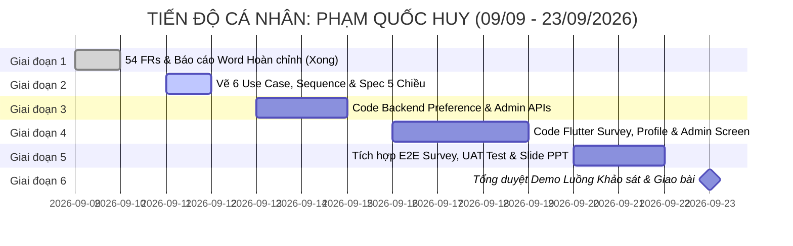

# 📋 BẢNG PHÂN CÔNG NHIỆM VỤ CÁ NHÂN CHI TIẾT: PHẠM QUỐC HUY

> **Họ và tên**: **Phạm Quốc Huy**  
> **Mã số sinh viên (MSSV)**: **24110226**  
> **Vai trò nòng cốt**: **Main Fullstack Developer** *(Lập trình viên chính tham gia toàn bộ vòng đời SDLC)*  
> **Mảng Kỹ thuật Phụ trách Đầu mối (Lead)**: **Lead BA & Báo cáo Học thuật (Requirements & Documentation Lead)**  
> **Dự án**: Nền tảng Tìm bạn cùng thuê trọ và Ghép bạn trọ theo tiêu chí (Roommate Matching Hub)  
> **Công nghệ thực hiện**: Java 21 Spring Boot 3 (Backend) + Flutter Dart (Frontend) + MySQL 8.0  
> **Thời gian thực hiện**: **09/09/2026 – 23/09/2026** (14 ngày / 2 tuần)  
> **HẠN CHÓT BÀN GIAO TOÀN DIỆN (HARD DEADLINE)**: ⏰ **18:00 Thứ Tư, ngày 23/09/2026**

---

## 🎯 1. TỔNG QUAN PHẠM VI TRÁCH NHIỆM (SCOPE OF WORK)

| Phân hệ đảm nhiệm | File / Module cụ thể | Nhiệm vụ chính |
| :--- | :--- | :--- |
| **Backend (Spring Boot 3)** | `controller/ProfileController.java`<br>`service/ProfileService.java`<br>`repository/UserPreferenceRepository.java`<br>`dto/UserPreferenceDTO.java`<br>`controller/AdminController.java`<br>`service/AdminService.java` | Lập trình toàn bộ APIs khảo sát tiêu chí 5 chiều (`UserPreference`), xem/cập nhật hồ sơ cá nhân (`Profile`), và các APIs quản trị hệ thống của Admin (khóa/mở user, duyệt bài đăng, xử lý báo cáo). |
| **Frontend (Flutter Client)** | `screens/survey_screen.dart`<br>`screens/profile_screen.dart`<br>`screens/admin_screen.dart`<br>`services/api_service.dart` | Thiết kế giao diện đa bước Form khảo sát 5 chiều (Stepper/PageView), Màn hình hồ sơ cá nhân & chỉnh sửa tiêu chí, và Màn hình bảng điều khiển Quản trị viên (Admin Dashboard). |
| **Lead BA & Tài liệu** | `docs/Nhom13_Mohinhhoayeucau.docx`<br>`docs/diagrams/use_cases/`<br>`docs/diagrams/sequences/`<br>`docs/SLIDE_PRESENTATION.pptx` | Chủ trì xây dựng 54 yêu cầu chức năng (FRs), vẽ 6 Lược đồ Use Case, Sequence Diagram luồng Khảo sát & Admin, biên soạn Slide báo cáo bảo vệ cuối kỳ. |

---

## 📅 2. BẢNG TIẾN ĐỘ VÀ DEADLINE TỪNG MỐC CỦA QUỐC HUY



---

## 📝 3. NHIỆM VỤ ĐI SÂU CHI TIẾT TỪNG GIAI ĐOẠN (STEP-BY-STEP DEEP TASKS)

---

### GIAI ĐOẠN 1: KHẢO SÁT & MÔ HÌNH HÓA YÊU CẦU (09/09 – 10/09/2026)
*Trạng thái: ✅ ĐÃ HOÀN THÀNH XUẤT SẮC*

- [x] **Task QH-1.1: Khảo sát hiện trạng & Đối chiếu 4 mẫu báo cáo của Giảng viên**  
  - *Kết quả*: Hoàn thành khảo sát nhu cầu tìm bạn ở ghép, giải quyết vấn đề bất tương thích lối sống của sinh viên.
- [x] **Task QH-1.2: Biên soạn tài liệu học thuật `Nhom13_Mohinhhoayeucau.docx`**  
  - *Kết quả*: 155 đoạn văn, 29 bảng, trang bìa chuẩn, mục lục tự động, danh mục 54 Yêu cầu chức năng (FRs), 5 biểu mẫu giao diện và 7 đặc tả Use Case chi tiết.
- [x] **Task QH-1.3: Đồng bộ danh mục thực thể với bảng CSDL MySQL**  
  - *Kết quả*: Kiểm tra tính khớp nối giữa 54 FRs và file DDL `database/01_schema.sql`.

---

### GIAI ĐOẠN 2: THIẾT KẾ KIẾN TRÚC HỆ THỐNG & ĐẶC TẢ CHI TIẾT (11/09 – 12/09/2026)
*Mục tiêu giai đoạn: Hoàn tất 100% sơ đồ Use Case, Sequence Diagram và bộ tiêu chí 5 chiều để làm tiền đề cho việc code.*  
*Hạn chót toàn giai đoạn 2: ⏰ **23:59 Thứ Bảy, 12/09/2026***  
*Nhánh Git thực hiện*: `docs/use-case-design`

#### 📌 Task QH-2.1: Thiết kế 6 Lược đồ Use Case phân hệ chi tiết
- **Thời hạn hoàn thành**: ⏰ **17:00 Thứ Sáu, 11/09/2026**
- **Nhiệm vụ cụ thể**:
  - Dùng Draw.io / StarUML / PlantUML vẽ 6 sơ đồ Use Case bao phủ trọn vẹn 54 FRs:
    1. *Use Case Phân hệ 1 - Xác thực & Quản lý Tài khoản*: Đăng ký sinh viên, Xác thực email OTP, Đăng nhập, Đổi mật khẩu, Quên mật khẩu.
    2. *Use Case Phân hệ 2 - Khảo sát & Quản lý Tiêu chí cá nhân*: Điền khảo sát 5 chiều, Chỉnh sửa ngân sách, Cập nhật thói quen, Chọn tag sở thích.
    3. *Use Case Phân hệ 3 - Tìm kiếm & Gợi ý Ghép đôi*: Xem danh sách gợi ý bạn trọ (% Match), Lọc theo quận/giá, Xem chi tiết đối chiếu tiêu chí.
    4. *Use Case Phân hệ 4 - Lời mời ghép đôi & Phê duyệt (Double Opt-in)*: Gửi lời mời ghép đôi, Chấp nhận lời mời, Từ chối lời mời, Mở khóa liên hệ Zalo/SĐT.
    5. *Use Case Phân hệ 5 - Đăng tin phòng trọ & Đặt lịch hẹn xem phòng*: Đăng tin tìm người ghép, Lọc phòng trọ, Đặt lịch hẹn xem trọ, Xác nhận lịch hẹn.
    6. *Use Case Phân hệ 6 - Quản trị hệ thống (Admin)*: Khóa/mở tài khoản vi phạm, Duyệt bài đăng phòng trọ, Xử lý báo cáo tố cáo (Report).
  - Sử dụng đúng các quan hệ `<<include>>` (ví dụ: Gửi lời mời `<<include>>` Đăng nhập) và `<<extend>>` (ví dụ: Chấp nhận lời mời `<<extend>>` Cấp quyền xem SĐT).
- **Đầu ra (Deliverables)**: 6 file ảnh định dạng PNG/SVG lưu tại `docs/diagrams/use_cases/` (`uc_auth.png`, `uc_preference.png`, `uc_matching.png`, `uc_invitation.png`, `uc_room.png`, `uc_admin.png`).
- **Lệnh Git thực hiện**:
  ```bash
  git checkout master
  git pull origin master
  git checkout -b docs/use-case-design
  # Thêm ảnh vào docs/diagrams/use_cases/
  git add docs/diagrams/use_cases/
  git commit -m "docs: bo sung 6 so do use case chi tiet cho 54 FRs"
  git push origin docs/use-case-design
  ```
- **Bàn giao chéo**: Gửi sơ đồ cho Quang Huy và Tiến Đạt để đối chiếu với API Contract và Class Diagram.

#### 📌 Task QH-2.2: Thiết kế Sequence Diagram luồng Khảo sát Tiêu chí & Quản trị Admin
- **Thời hạn hoàn thành**: ⏰ **12:00 Thứ Bảy, 12/09/2026**
- **Nhiệm vụ cụ thể**:
  - Vẽ Sơ đồ tuần tự (Sequence Diagram) thể hiện chính xác các bước giao tiếp giữa các tầng: `Flutter Client` ⇄ `ProfileController` ⇄ `ProfileService` ⇄ `UserPreferenceRepository` ⇄ `MySQL`:
    1. *Luồng Người dùng lưu/cập nhật Form khảo sát 5 chiều*: Kiểm tra Token hợp lệ -> Validate giá trị đầu vào (ngân sách > 0, thói quen hợp lệ) -> `save()` vào bảng `user_preferences` -> Trả về DTO cập nhật thành công.
    2. *Luồng Admin phê duyệt bài đăng / Khóa tài khoản*: Client Admin gửi request -> Spring Security lọc quyền `ROLE_ADMIN` -> Cập nhật trạng thái trong DB -> Gửi phản hồi 200 OK.
- **Đầu ra**: 2 sơ đồ tuần tự định dạng PNG lưu tại `docs/diagrams/sequences/` (`seq_survey.png`, `seq_admin.png`).

#### 📌 Task QH-2.3: Xây dựng Bộ đặc tả Thuật toán Tiêu chí 5 Chiều (5D Preference Spec)
- **Thời hạn hoàn thành**: ⏰ **23:59 Thứ Bảy, 12/09/2026**
- **Nhiệm vụ cụ thể**:
  - Soạn thảo tài liệu đặc tả chi tiết 5 nhóm thuộc tính của bảng `user_preferences`:
    - *Chiều 1 - Ngân sách (Budget)*: `min_price`, `max_price` (VNĐ/tháng). Thang đo: 1.000.000 đến 15.000.000 VNĐ.
    - *Chiều 2 - Khu vực địa lý (Location)*: `preferred_district` (danh sách Quận tại TP.HCM: Quận 1, Quận 7, Bình Thạnh, TP. Thủ Đức...).
    - *Chiều 3 - Lối sống (Lifestyle)*: `sleep_habit` (EARLY_BIRD / NIGHT_OWL), `cooking_habit` (COOK_DAILY / EAT_OUT / FLEXIBLE).
    - *Chiều 4 - Thói quen (Habits)*: `cleanliness_level` (1 đến 5 sao), `smoking` (true/false), `pet_friendly` (true/false).
    - *Chiều 5 - Tính cách & Sở thích (Personality & Interests)*: `personality_type` (INTROVERT / EXTROVERT / AMBIVERT), `interests` (Chuỗi JSON hoặc tags: Đọc sách, Thể thao, Game, Âm nhạc...).
- **Đầu ra**: File tài liệu `docs/PREFERENCE_CRITERIA_SPEC.md` bàn giao trực tiếp cho Quang Huy để cài đặt công thức toán học trong `MatchingService.java`.

#### 📌 Task QH-2.4: Báo cáo Thiết kế dữ liệu và Cơ sở dữ liệu (Giao bổ sung)
- **Thời hạn hoàn thành**: ⏰ **23:59 Chủ Nhật, 13/09/2026**
- **Nhiệm vụ cụ thể**:
  - Dựa trên file mẫu đã có trong `docs/BaoCaoMau_ThietKeCSDL va ThietKeGiaoDien (1).docx` (nhánh `fix/setup-and-tests`), soạn thảo báo cáo phần Thiết kế dữ liệu.
  - Đảm bảo gom toàn bộ nội dung từ đầu báo cáo cho đến hết phần Thiết kế dữ liệu.
  - Lưu ý sử dụng sơ đồ Class Diagram và schema CSDL mà Tiến Đạt đã thiết kế ở Giai đoạn 2.
- **Đầu ra**: File tài liệu `docs/Nhom13_ThietKeDuLieu.docx`.

---

### GIAI ĐOẠN 3: LẬP TRÌNH BACKEND SPRING BOOT 3 (13/09 – 15/09/2026)
*Mục tiêu giai đoạn: Hoàn thiện 100% mã nguồn Java Spring Boot cho module Profile, Preference và Admin, viết Unit Test đạt độ phủ tốt.*  
*Hạn chót toàn giai đoạn 3: ⏰ **23:59 Thứ Hai, 15/09/2026***  
*Nhánh Git thực hiện*: `feature/preference-admin-backend`

#### 📌 Task QH-3.1: Lập trình Backend Module `UserPreference` & `Profile`
- **Thời hạn hoàn thành**: ⏰ **18:00 Chủ Nhật, 14/09/2026**
- **Các file cần chỉnh sửa / tạo mới**:
  - `backend/src/main/java/com/roommate/hub/dto/UserPreferenceDTO.java`:
    - Khai báo đầy đủ các trường: `minBudget`, `maxBudget`, `preferredLocation`, `sleepHabit`, `cookingHabit`, `cleanlinessLevel`, `smoking`, `petFriendly`, `personalityType`, `interests`.
    - Thêm Bean Validation: `@NotNull`, `@Min(0)`, `@Max(5)` cho các trường tương ứng.
  - `backend/src/main/java/com/roommate/hub/repository/UserPreferenceRepository.java`:
    - Bổ sung query method: `Optional<UserPreference> findByUserId(Long userId);`
    - `boolean existsByUserId(Long userId);`
  - `backend/src/main/java/com/roommate/hub/service/ProfileService.java`:
    - Viết logic hàm `saveOrUpdatePreference(Long userId, UserPreferenceDTO dto)`: Nếu đã tồn tại bản ghi của user thì update các trường, nếu chưa thì khởi tạo mới và gán `user`.
    - Viết logic hàm `getPreferenceByUserId(Long userId)`: Lấy dữ liệu trả về `UserPreferenceDTO`.
    - Viết hàm `getUserProfile(Long userId)` và `updateUserProfile(Long userId, ProfileUpdateDTO dto)`.
  - `backend/src/main/java/com/roommate/hub/controller/ProfileController.java`:
    - `POST /api/v1/profile/preferences`: Lưu kết quả khảo sát.
    - `GET /api/v1/profile/preferences/me`: Lấy tiêu chí của user hiện tại từ `@AuthenticationPrincipal`.
    - `PUT /api/v1/profile/preferences`: Cập nhật tiêu chí khảo sát.
    - `GET /api/v1/profile/user/{id}`: Xem thông tin công khai của ứng viên.
- **Tiêu chí nghiệm thu (Definition of Done)**:
  - Test request thành công qua Postman với token Bearer hợp lệ: HTTP 200/201.
  - Test dữ liệu sai (ngân sách âm): Trả về HTTP 400 Bad Request kèm message rõ ràng.

#### 📌 Task QH-3.2: Lập trình Backend Module Quản trị viên (`AdminController` & `AdminService`)
- **Thời hạn hoàn thành**: ⏰ **18:00 Thứ Hai, 15/09/2026**
- **Các file cần chỉnh sửa / tạo mới**:
  - `backend/src/main/java/com/roommate/hub/service/AdminService.java`:
    - Hàm `getAllUsers(Pageable pageable, String status)`: Lấy danh sách người dùng kèm phân trang.
    - Hàm `toggleUserStatus(Long userId, String newStatus)`: Đổi trạng thái giữa `ACTIVE` và `BLOCKED`.
    - Hàm `approveRoomPost(Long postId, boolean isApproved, String reason)`: Duyệt hoặc từ chối bài đăng phòng trọ.
    - Hàm `resolveReport(Long reportId, String actionNote)`: Đánh dấu đã giải quyết tố cáo.
  - `backend/src/main/java/com/roommate/hub/controller/AdminController.java`:
    - Cấu hình bảo mật `@PreAuthorize("hasRole('ADMIN')")` trên toàn bộ controller.
    - `GET /api/v1/admin/users`: Trả về danh sách user có phân trang.
    - `PUT /api/v1/admin/users/{id}/status`: Cập nhật trạng thái tài khoản.
    - `PUT /api/v1/admin/posts/{id}/approve`: Duyệt tin đăng phòng trọ.
- **Tiêu chí nghiệm thu (DoD)**:
  - Tài khoản User thông thường gọi API Admin: Trả về HTTP 403 Forbidden.
  - Tài khoản Admin gọi API: Trả về dữ liệu đúng 100%.

#### 📌 Task QH-3.3: Viết Bộ Unit Tests tự động cho `ProfileService` & `AdminService`
- **Thời hạn hoàn thành**: ⏰ **23:59 Thứ Hai, 15/09/2026**
- **File tạo mới**:
  - `backend/src/test/java/com/roommate/hub/service/ProfileServiceTest.java`:
    - Test 1: Lưu tiêu chí mới thành công (Happy path).
    - Test 2: Cập nhật tiêu chí khi đã có bản ghi cũ.
    - Test 3: Ném ngoại lệ `ResourceNotFoundException` khi không tìm thấy `userId`.
  - `backend/src/test/java/com/roommate/hub/service/AdminServiceTest.java`:
    - Test 1: Khóa tài khoản thành công đổi trạng thái sang `BLOCKED`.
    - Test 2: Duyệt bài đăng thành công đổi status sang `APPROVED`.
- **Lệnh thực thi & kiểm tra**:
  ```bash
  cd backend
  .\mvnw.cmd test -Dtest=ProfileServiceTest,AdminServiceTest
  ```
  *(Yêu cầu: Toàn bộ tests chạy pass màu xanh, không có Failure hoặc Error).*

---

### GIAI ĐOẠN 4: LẬP TRÌNH FRONTEND FLUTTER CLIENT (16/09 – 19/09/2026)
*Mục tiêu giai đoạn: Xây dựng giao diện khảo sát tiêu chí mượt mà, màn hình hồ sơ cá nhân và trang quản trị Admin trực quan.*  
*Hạn chót toàn giai đoạn 4: ⏰ **23:59 Thứ Sáu, 19/09/2026***  
*Nhánh Git thực hiện*: `feature/survey-profile-flutter`

#### 📌 Task QH-4.1: Xây dựng Giao diện Form Khảo sát Tiêu chí 5 chiều (`survey_screen.dart`)
- **Thời hạn hoàn thành**: ⏰ **23:59 Thứ Tư, 17/09/2026**
- **Chi tiết giao diện & Widget kỹ thuật**:
  - Mở file `frontend/lib/screens/survey_screen.dart`, nâng cấp thành giao diện **Multi-step Stepper** gồm 5 bước:
    - *Bước 1: Ngân sách & Khu vực*:
      - `RangeSlider` chọn giá từ 1M đến 15M VNĐ (hiển thị Text nhãn giá tiền format VNĐ: ví dụ `2.500.000 đ - 5.000.000 đ`).
      - `DropdownButtonFormField` hoặc `ChoiceChip` chọn Quận/Huyện TP.HCM.
    - *Bước 2: Lối sống sinh hoạt*:
      - Radio/SegmentedButton chọn Thói quen ngủ: "Dậy sớm (Early Bird)" vs "Cú đêm (Night Owl)".
      - SegmentedButton chọn Nấu ăn: "Tự nấu ở nhà" vs "Ăn ngoài / Tiện lợi".
    - *Bước 3: Thói quen cá nhân*:
      - Đánh giá mức độ sạch sẽ/ngăn nắp: Rating Bar 1-5 sao.
      - SwitchListTile hoặc Chip chọn: "Hút thuốc (Có/Không)", "Thú cưng (Thích/Dị ứng/Không nuôi)".
    - *Bước 4: Tính cách & Sở thích*:
      - SegmentedButton: Hướng nội / Hướng ngoại / Linh hoạt.
      - `Wrap` chứa các `FilterChip` đa lựa chọn (Thể thao, Đọc sách, Chơi game, Xem phim, Du lịch, Âm nhạc...).
    - *Bước 5: Tổng quan & Xác nhận*:
      - Hiển thị Card tóm tắt toàn bộ tiêu chí đã chọn.
      - Nút ElevatedButton "Lưu tiêu chí & Tìm bạn trọ ngay".
  - Bắt lỗi Form (Validation): Nếu người dùng chưa chọn bước bắt buộc, hiển thị `SnackBar` cảnh báo.

#### 📌 Task QH-4.2: Xây dựng Giao diện Màn hình Hồ sơ Cá nhân (`profile_screen.dart`)
- **Thời hạn hoàn thành**: ⏰ **23:59 Thứ Năm, 18/09/2026**
- **Chi tiết giao diện & Widget kỹ thuật**:
  - Mở file `frontend/lib/screens/profile_screen.dart`:
    - Header: `CircleAvatar` hiển thị ảnh đại diện, Tên hiển thị, Email sinh viên, Trường ĐH.
    - Huy hiệu Xác thực: Badge xanh lá "Đã xác thực thẻ sinh viên" (Student Verified).
    - Section "Tiêu chí ghép trọ hiện tại": Hiển thị các Chip tóm tắt (Giá: 2-4tr, Quận: Bình Thạnh, Không hút thuốc...).
    - Nút Action "Cập nhật tiêu chí": Nhấn vào sẽ điều hướng mở lại `survey_screen.dart` và tự động fill lại các giá trị cũ.
    - Section Cài đặt: Nút "Đổi mật khẩu" (mở Dialog nhập mật khẩu cũ/mới), Nút "Đăng xuất" (Xóa token trong `SharedPreferences` và chuyển về `login_screen.dart`).

#### 📌 Task QH-4.3: Xây dựng Giao diện Bảng điều khiển Quản trị (`admin_screen.dart`)
- **Thời hạn hoàn thành**: ⏰ **23:59 Thứ Sáu, 19/09/2026**
- **Chi tiết giao diện & Widget kỹ thuật**:
  - Mở file `frontend/lib/screens/admin_screen.dart`:
    - Cấu trúc `DefaultTabController` với 3 Tabs:
      1. *Tab 1 - Quản lý Người dùng*: `ListView.builder` hiển thị thẻ người dùng, status chip (ACTIVE: xanh, BLOCKED: đỏ), nút chuyển đổi Khóa / Mở khóa tài khoản kèm hộp thoại xác nhận (`showDialog`).
      2. *Tab 2 - Kiểm duyệt Bài đăng*: Hiển thị danh sách tin đăng phòng trọ đang chờ duyệt (`PENDING`), nút "Duyệt" (xanh lá) và nút "Từ chối" (đỏ kèm ô nhập lý do từ chối).
      3. *Tab 3 - Xử lý Tố cáo (Reports)*: Danh sách tố cáo vi phạm từ sinh viên kèm nội dung lý do, nút "Đã xử lý".
- **Tiêu chí nghiệm thu**: Giao diện hiển thị chuẩn responsive, chạy mượt mà trên cả trình duyệt Web (Chrome/Edge) và Mobile.

---

### GIAI ĐOẠN 5: TÍCH HỢP E2E, KIỂM THỬ UAT & HOÀN THIỆN BÁO CÁO (20/09 – 22/09/2026)
*Mục tiêu giai đoạn: Kết nối giao diện gọi API thật, kiểm thử chấp nhận người dùng và hoàn thiện slide báo cáo đồ án.*  
*Hạn chót toàn giai đoạn 5: ⏰ **23:59 Thứ Ba, 22/09/2026***  
*Nhánh Git thực hiện*: `integration/survey-profile` & `docs/final-slide`

#### 📌 Task QH-5.1: Tích hợp Frontend Survey & Profile với API Backend
- **Thời hạn hoàn thành**: ⏰ **18:00 Chủ Nhật, 20/09/2026**
- **Nhiệm vụ cụ thể**:
  - Cập nhật file `frontend/lib/services/api_service.dart`:
    - Viết hàm `Future<bool> savePreferences(Map<String, dynamic> data)`
    - Viết hàm `Future<Map<String, dynamic>?> getMyPreferences()`
    - Viết hàm `Future<List<dynamic>> getAdminUsers()`
    - Viết hàm `Future<bool> toggleUserStatus(int userId, String status)`
  - Kết nối `survey_screen.dart`: Khi bấm "Lưu tiêu chí", hiển thị vòng quay `CircularProgressIndicator`, gọi API, nếu thành công thì hiển thị Toast thông báo và chuyển hướng sang trang Discovery của Quang Huy.
- **Tiêu chí nghiệm thu**: Dữ liệu khảo sát từ giao diện Flutter được lưu chính xác vào bảng `user_preferences` trong MySQL.

#### 📌 Task QH-5.2: Soạn thảo Bộ Kịch bản Kiểm thử Chấp nhận Người dùng (UAT Test Cases)
- **Thời hạn hoàn thành**: ⏰ **18:00 Thứ Hai, 21/09/2026**
- **Nhiệm vụ cụ thể**:
  - Soạn file `docs/UAT_SURVEY_ADMIN.md` gồm 12 kịch bản kiểm thử chi tiết:
    - Kịch bản UAT-01: Đăng nhập -> Vào form khảo sát -> Điền đủ 5 bước -> Bấm lưu -> Kiểm tra DB và xem giao diện cập nhật.
    - Kịch bản UAT-02: Để trống trường ngân sách -> Bấm tiếp tục -> Hệ thống hiển thị thông báo chặn và yêu cầu nhập.
    - Kịch bản UAT-03: Đăng nhập quyền Admin -> Vào màn hình Admin -> Bấm khóa tài khoản user -> Thử dùng user đó đăng nhập lại -> Kiểm tra bị chặn.
  - Bàn giao tài liệu cho QA Lead Tiến Đạt để đưa vào biên bản nghiệm thu chung.

#### 📌 Task QH-5.3: Hoàn thiện Slide Báo cáo & Bổ sung Tài liệu Word Đồ án
- **Thời hạn hoàn thành**: ⏰ **23:59 Thứ Ba, 22/09/2026**
- **Nhiệm vụ cụ thể**:
  - Thiết kế bộ Slide thuyết trình chính thức (`docs/SLIDE_PRESENTATION.pptx`):
    - Slide 1-3: Giới thiệu đề tài Roommate Hub, thành viên nhóm và phân công vai trò.
    - Slide 4-6: Khảo sát hiện trạng, 54 Yêu cầu chức năng và 6 Lược đồ Use Case.
    - Slide 7-9: Kiến trúc hệ thống Fullstack (Spring Boot + Flutter + MySQL).
    - Slide 10-12: Thuật toán Matching 5 chiều và Quy trình Double Opt-in.
    - Slide 13-15: Kịch bản Demo trực tiếp và Kết quả đạt được.
  - Cập nhật toàn bộ ảnh chụp giao diện và sơ đồ mới vào file Word [`docs/Nhom13_Mohinhhoayeucau.docx`](docs/Nhom13_Mohinhhoayeucau.docx).

---

### GIAI ĐOẠN 6: TỔNG DUYỆT DEMO & BÀN GIAO TOÀN DIỆN (23/09/2026)
*Mục tiêu giai đoạn: Diễn tập kịch bản demo trơn tru, bàn giao toàn bộ sản phẩm hoàn chỉnh trước giờ G.*  
*HẠN CHÓT BÀN GIAO TOÀN DỰ ÁN: ⏰ **18:00 Thứ Tư, 23/09/2026***

- [ ] **Task QH-6.1: Diễn tập Kịch bản Thuyết trình & Demo Luồng Khảo sát / Admin**
  - *Thời hạn*: ⏰ **12:00 Thứ Tư, 23/09/2026**
  - *Nhiệm vụ*: Phối hợp cùng Quang Huy và Tiến Đạt chạy thử kịch bản thuyết trình:
    1. Trình bày đặt vấn đề và kiến trúc phân hệ.
    2. Demo trực tiếp luồng một bạn sinh viên mới điền khảo sát tiêu chí 5 chiều.
    3. Demo luồng Admin khóa tài khoản vi phạm và duyệt bài đăng phòng.
- [ ] **Task QH-6.2: Đóng gói và Nộp toàn bộ Sản phẩm Báo cáo**
  - *Thời hạn*: ⏰ **18:00 Thứ Tư, 23/09/2026**
  - *Nhiệm vụ*: Đảm bảo các file tài liệu sau đã có bản hoàn thiện trong Git:
    - [`docs/Nhom13_Mohinhhoayeucau.docx`](docs/Nhom13_Mohinhhoayeucau.docx)
    - `docs/SLIDE_PRESENTATION.pptx` (hoặc PDF)
    - Toàn bộ sơ đồ trong `docs/diagrams/`

---

## 🔍 4. CHECKLIST TỰ RÀ SOÁT CHẤT LƯỢNG CỦA QUỐC HUY (BEFORE PR)

- [ ] Các class Java tuân thủ đúng package `com.roommate.hub`.
- [ ] Các API Controller có đầy đủ mã phản hồi chuẩn (`200 OK`, `201 Created`, `400 Bad Request`, `403 Forbidden`, `404 Not Found`).
- [ ] Form khảo sát Flutter có bộ điều khiển giá trị (TextEditingController / State) và validate kỹ càng, không gây crash ứng dụng.
- [ ] Tài liệu Word không bị nhảy trang hay vỡ khung viền trang bìa.
- [ ] Đã chạy `git pull origin master` giải quyết xung đột trước khi gửi PR cho PM Leader.
