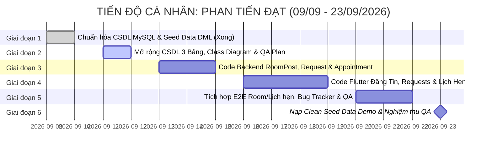

# 📋 BẢNG PHÂN CÔNG NHIỆM VỤ CÁ NHÂN CHI TIẾT: PHAN TIẾN ĐẠT

> **Họ và tên**: **Phan Tiến Đạt**  
> **Mã số sinh viên (MSSV)**: **24110195**  
> **Vai trò nòng cốt**: **Main Fullstack Developer** *(Lập trình viên chính tham gia toàn bộ vòng đời SDLC)*  
> **Mảng Kỹ thuật Phụ trách Đầu mối (Lead)**: **Lead Cơ sở Dữ liệu & Đảm bảo Chất lượng (Database & QA Lead)**  
> **Dự án**: Nền tảng Tìm bạn cùng thuê trọ và Ghép bạn trọ theo tiêu chí (Roommate Matching Hub)  
> **Công nghệ thực hiện**: Java 21 Spring Boot 3 (Backend) + Flutter Dart (Frontend) + MySQL 8.0  
> **Thời gian thực hiện**: **09/09/2026 – 23/09/2026** (14 ngày / 2 tuần)  
> **HẠN CHÓT BÀN GIAO TOÀN DIỆN (HARD DEADLINE)**: ⏰ **18:00 Thứ Tư, ngày 23/09/2026**

---

## 🎯 1. TỔNG QUAN PHẠM VI TRÁCH NHIỆM (SCOPE OF WORK)

| Phân hệ đảm nhiệm | File / Module cụ thể | Nhiệm vụ chính |
| :--- | :--- | :--- |
| **Backend (Spring Boot 3)** | `controller/RoomPostController.java`<br>`service/RoomPostService.java`<br>`repository/RoomPostRepository.java`<br>`service/MatchRequestService.java`<br>`repository/MatchRequestRepository.java`<br>`entity/ViewingAppointment.java`<br>`service/AppointmentService.java` | Lập trình toàn bộ APIs Quản lý Bài đăng Phòng trọ (`RoomPost`) kèm tìm kiếm phân trang/lọc theo quận/giá, Module Lời mời ghép đôi với cơ chế **Double Opt-in** (chỉ mở khóa số điện thoại khi cả hai đồng ý), và Module Đặt lịch hẹn xem phòng trực tiếp (`ViewingAppointment`). |
| **Frontend (Flutter Client)** | `screens/create_post_screen.dart`<br>`screens/requests_screen.dart`<br>`models/room_post.dart`<br>`models/match_request_item.dart`<br>`services/api_service.dart` | Xây dựng Giao diện Đăng bài tìm bạn ở ghép / cho thuê phòng, Màn hình Quản lý Lời mời ghép đôi (Chấp nhận / Từ chối / Xem liên hệ Zalo-SĐT), và Màn hình Quản lý Lịch hẹn xem trọ trực tiếp. |
| **Lead Database & QA** | `database/01_schema.sql`<br>`database/02_seed_data.sql`<br>`database/roommate_hub.sql`<br>`docs/TEST_PLAN.md`<br>`docs/BUG_TRACKER.md`<br>`docs/diagrams/classes/` | Quản lý toàn bộ cấu trúc CSDL MySQL, bổ sung 3 bảng mới (`appointments`, `contact_permissions`, `reports`), vẽ Sơ đồ Lớp thực thể (Class Diagram), lập Kế hoạch kiểm thử QA (54 FRs), vận hành Bug Tracker và chuẩn bị bộ Dữ liệu mẫu Demo sạch (Clean Seed Data). |

---

## 📅 2. BẢNG TIẾN ĐỘ VÀ DEADLINE TỪNG MỐC CỦA TIẾN ĐẠT



---

## 📝 3. NHIỆM VỤ ĐI SÂU CHI TIẾT TỪNG GIAI ĐOẠN (STEP-BY-STEP DEEP TASKS)

---

### GIAI ĐOẠN 1: CHUẨN HÓA CƠ SỞ DỮ LIỆU BAN ĐẦU (09/09 – 10/09/2026)
*Trạng thái: ✅ ĐÃ HOÀN THÀNH XUẤT SẮC*

- [x] **Task TD-1.1: Phân tách và chuẩn hóa file DDL `database/01_schema.sql`**  
  - *Kết quả*: Tạo các bảng `users`, `user_preferences`, `room_posts`, `match_requests` kèm chỉ mục và ràng buộc khóa ngoại.
- [x] **Task TD-1.2: Xây dựng bộ dữ liệu mẫu ban đầu `database/02_seed_data.sql`**  
  - *Kết quả*: Tạo tài khoản Admin mặc định và 3 tài khoản User sinh viên mẫu có mật khẩu mã hóa BCrypt (`123456`).
- [x] **Task TD-1.3: Soạn tài liệu hướng dẫn vận hành CSDL tại `database/README.md`**  
  - *Kết quả*: Hướng dẫn chi tiết cách chạy script bằng CLI, DBeaver và Workbench.

---

### GIAI ĐOẠN 2: MỞ RỘNG CSDL MYSQL & KẾ HOẠCH KIỂM THỬ QA (11/09 – 12/09/2026)
*Mục tiêu giai đoạn: Mở rộng CSDL phục vụ 54 yêu cầu chức năng mở rộng, thiết kế Class Diagram và lập kế hoạch kiểm thử QA.*  
*Hạn chót toàn giai đoạn 2: ⏰ **23:59 Thứ Bảy, 12/09/2026***  
*Nhánh Git thực hiện*: `feature/database-expansion`

#### 📌 Task TD-2.1: Viết Script Mở rộng CSDL MySQL (Bổ sung 3 bảng mới)
- **Thời hạn hoàn thành**: ⏰ **18:00 Thứ Sáu, 11/09/2026**
- **Nhiệm vụ kỹ thuật cụ thể**:
  - Mở file `database/01_schema.sql` và `database/roommate_hub.sql`, bổ sung 3 bảng phục vụ 54 FRs:
    1. **Bảng `viewing_appointments` (Quản lý Lịch hẹn xem phòng trực tiếp)**:
       ```sql
       CREATE TABLE IF NOT EXISTS viewing_appointments (
           id BIGINT AUTO_INCREMENT PRIMARY KEY,
           requester_id BIGINT NOT NULL,
           host_id BIGINT NOT NULL,
           room_post_id BIGINT NOT NULL,
           appointment_time DATETIME NOT NULL,
           status VARCHAR(20) NOT NULL DEFAULT 'PENDING', -- PENDING, CONFIRMED, COMPLETED, CANCELLED
           note TEXT NULL,
           created_at TIMESTAMP DEFAULT CURRENT_TIMESTAMP,
           updated_at TIMESTAMP DEFAULT CURRENT_TIMESTAMP ON UPDATE CURRENT_TIMESTAMP,
           FOREIGN KEY (requester_id) REFERENCES users(id) ON DELETE CASCADE,
           FOREIGN KEY (host_id) REFERENCES users(id) ON DELETE CASCADE,
           FOREIGN KEY (room_post_id) REFERENCES room_posts(id) ON DELETE CASCADE
       ) ENGINE=InnoDB DEFAULT CHARSET=utf8mb4 COLLATE=utf8mb4_unicode_ci;
       ```
    2. **Bảng `contact_permissions` (Cơ chế Double Opt-in bảo vệ quyền riêng tư)**:
       ```sql
       CREATE TABLE IF NOT EXISTS contact_permissions (
           id BIGINT AUTO_INCREMENT PRIMARY KEY,
           user_id BIGINT NOT NULL,          -- Người cho phép xem
           granted_to_id BIGINT NOT NULL,    -- Người được phép xem SĐT
           match_request_id BIGINT NOT NULL,
           granted_at TIMESTAMP DEFAULT CURRENT_TIMESTAMP,
           FOREIGN KEY (user_id) REFERENCES users(id) ON DELETE CASCADE,
           FOREIGN KEY (granted_to_id) REFERENCES users(id) ON DELETE CASCADE,
           FOREIGN KEY (match_request_id) REFERENCES match_requests(id) ON DELETE CASCADE,
           UNIQUE KEY uq_contact_grant (user_id, granted_to_id)
       ) ENGINE=InnoDB DEFAULT CHARSET=utf8mb4 COLLATE=utf8mb4_unicode_ci;
       ```
    3. **Bảng `reports` (Quản lý Báo cáo Tố cáo vi phạm)**:
       ```sql
       CREATE TABLE IF NOT EXISTS reports (
           id BIGINT AUTO_INCREMENT PRIMARY KEY,
           reporter_id BIGINT NOT NULL,
           target_id BIGINT NOT NULL,
           target_type VARCHAR(20) NOT NULL, -- 'USER' hoặc 'ROOM_POST'
           reason TEXT NOT NULL,
           status VARCHAR(20) NOT NULL DEFAULT 'PENDING', -- PENDING, RESOLVED, DISMISSED
           action_note TEXT NULL,
           created_at TIMESTAMP DEFAULT CURRENT_TIMESTAMP,
           FOREIGN KEY (reporter_id) REFERENCES users(id) ON DELETE CASCADE
       ) ENGINE=InnoDB DEFAULT CHARSET=utf8mb4 COLLATE=utf8mb4_unicode_ci;
       ```
  - Bổ sung các chỉ mục (Indexes) để tăng tốc độ truy vấn:
    `CREATE INDEX idx_room_posts_district ON room_posts(district);`
    `CREATE INDEX idx_room_posts_price ON room_posts(price);`
- **Đầu ra**: Cập nhật hoàn tất `database/01_schema.sql`, `database/02_seed_data.sql` và `database/roommate_hub.sql`.
- **Bàn giao chéo**: Gửi thông báo cho Quốc Huy và Quang Huy để ánh xạ Entity Java tương ứng.

#### 📌 Task TD-2.2: Thiết kế Sơ đồ Lớp thực thể (Class Diagram: Entity, DTO, Repository)
- **Thời hạn hoàn thành**: ⏰ **12:00 Thứ Bảy, 12/09/2026**
- **Nhiệm vụ cụ thể**:
  - Vẽ Sơ đồ Lớp (Class Diagram) bằng Draw.io / PlantUML thể hiện đầy đủ cấu trúc hướng đối tượng của Backend Spring Boot:
    - Các Entity: `User`, `UserPreference`, `RoomPost`, `MatchRequest`, `ViewingAppointment`, `ContactPermission`, `Report`.
    - Thể hiện quan hệ: `1 - 1` giữa `User` và `UserPreference`; `1 - n` giữa `User` và `RoomPost`; `1 - n` giữa `User` và `MatchRequest`.
    - Liệt kê các Interface Repository kế thừa `JpaRepository`.
- **Đầu ra**: File ảnh `docs/diagrams/classes/class_diagram.png` và bàn giao cho Quốc Huy chèn vào báo cáo học thuật.

#### 📌 Task TD-2.3: Xây dựng Kế hoạch Kiểm thử Toàn diện (QA Test Plan)
- **Thời hạn hoàn thành**: ⏰ **23:59 Thứ Bảy, 12/09/2026**
- **Nhiệm vụ cụ thể**:
  - Soạn file tài liệu `docs/TEST_PLAN.md` bao phủ trọn vẹn 54 Yêu cầu chức năng (FRs):
    - Mục tiêu kiểm thử, phạm vi kiểm thử (In-scope / Out-of-scope).
    - Ma trận truy xuất nguồn gốc yêu cầu (Traceability Matrix): Mã FR -> Kịch bản kiểm thử tương ứng.
    - Tiêu chuẩn chấp nhận lỗi (Bug Severity Matrix):
      - *Critical (Nghiêm trọng)*: Hệ thống sập, rò rỉ mật khẩu, không thể đăng ký/đăng nhập.
      - *Major (Lớn)*: Lời mời không gửi được, tính sai % Matching, sai lệch giá phòng.
      - *Minor (Nhỏ)*: Lỗi lệch font, sai vị trí nút bấm, chưa dịch tiếng Việt.
- **Đầu ra**: File `docs/TEST_PLAN.md` chuẩn mực làm kim chỉ nam cho kiểm thử ở Giai đoạn 5.

---

### GIAI ĐOẠN 3: LẬP TRÌNH BACKEND SPRING BOOT 3 (13/09 – 15/09/2026)
*Mục tiêu giai đoạn: Xây dựng toàn bộ APIs Bài đăng phòng trọ, Lời mời ghép đôi Double Opt-in và Lịch hẹn xem trọ.*  
*Hạn chót toàn giai đoạn 3: ⏰ **23:59 Thứ Hai, 15/09/2026***  
*Nhánh Git thực hiện*: `feature/room-appointment-backend`

#### 📌 Task TD-3.1: Lập trình Backend Module Bài đăng Phòng trọ (`RoomPostController` & `Service`)
- **Thời hạn hoàn thành**: ⏰ **18:00 Chủ Nhật, 14/09/2026**
- **Các file cần chỉnh sửa / tạo mới**:
  - `backend/src/main/java/com/roommate/hub/repository/RoomPostRepository.java`:
    - Viết truy vấn phân trang kèm bộ lọc đa tiêu chí:
      `Page<RoomPost> findByDistrictAndPriceBetween(String district, Double minPrice, Double maxPrice, Pageable pageable);`
  - `backend/src/main/java/com/roommate/hub/service/RoomPostService.java`:
    - Hàm `createPost(Long userId, CreateRoomPostDTO dto)`: Kiểm tra thông tin hợp lệ -> Gán `user` làm chủ bài -> Lưu trạng thái `APPROVED` (hoặc `PENDING` nếu bật duyệt tin).
    - Hàm `getPostDetail(Long postId)`: Lấy chi tiết bài đăng và tự động tăng số lượt xem (`viewCount = viewCount + 1`).
    - Hàm `updatePost(Long userId, Long postId, CreateRoomPostDTO dto)`: Chỉ cho phép chủ bài sửa tin của mình.
    - Hàm `deletePost(Long userId, Long postId)`: Xóa hoặc chuyển trạng thái sang `INACTIVE`.
  - `backend/src/main/java/com/roommate/hub/controller/RoomPostController.java`:
    - `POST /api/v1/posts`: Tạo tin mới.
    - `GET /api/v1/posts`: Lấy danh sách tin có phân trang (`?page=0&size=10&district=Bình Thạnh&minPrice=2000000`).
    - `GET /api/v1/posts/{id}`: Xem chi tiết.
    - `PUT /api/v1/posts/{id}`: Sửa tin.
    - `DELETE /api/v1/posts/{id}`: Xóa tin.
- **Tiêu chí nghiệm thu (DoD)**:
  - Gọi `GET /api/v1/posts` trả về đúng định dạng JSON có phân trang (`totalPages`, `totalElements`, `content`).

#### 📌 Task TD-3.2: Lập trình Backend Lời mời Ghép đôi Double Opt-in & Đặt lịch hẹn
- **Thời hạn hoàn thành**: ⏰ **18:00 Thứ Hai, 15/09/2026**
- **Các file cần chỉnh sửa / tạo mới**:
  - `backend/src/main/java/com/roommate/hub/service/MatchRequestService.java`:
    - Hàm `sendMatchRequest(Long senderId, Long receiverId, String message)`:
      - Kiểm tra: Không được gửi lời mời cho chính mình.
      - Kiểm tra: Không được gửi trùng lặp nếu đã có lời mời đang `PENDING`.
      - Khởi tạo `MatchRequest` trạng thái `PENDING`.
    - Hàm `respondMatchRequest(Long receiverId, Long requestId, String status)`:
      - Nếu `status = "ACCEPTED"`: Cập nhật lời mời thành công, đồng thời tự động chèn bản ghi vào bảng `contact_permissions` để cả hai bên được phép nhìn thấy SĐT/Zalo của nhau (Double Opt-in).
      - Nếu `status = "REJECTED"`: Cập nhật trạng thái từ chối lịch sự.
  - Tạo mới `backend/src/main/java/com/roommate/hub/entity/ViewingAppointment.java` và `AppointmentService.java`:
    - Hàm `createAppointment(Long requesterId, Long postId, LocalDateTime appointmentTime, String note)`.
    - Hàm `updateAppointmentStatus(Long hostId, Long appointmentId, String status)` (CONFIRMED / CANCELLED).
    - Hàm `getMyAppointments(Long userId)`: Lấy các lịch hẹn mà user là người đặt hoặc là chủ phòng.
- **Tiêu chí nghiệm thu (DoD)**:
  - Khi một bên từ chối: Số điện thoại tuyệt đối không được trả về trong DTO.
  - Khi cả hai đồng ý: DTO trả về số điện thoại và email liên hệ rõ ràng.

#### 📌 Task TD-3.3: Viết Bộ Unit Tests cho RoomPost & MatchRequest
- **Thời hạn hoàn thành**: ⏰ **23:59 Thứ Hai, 15/09/2026**
- **File tạo mới**:
  - `backend/src/test/java/com/roommate/hub/service/RoomPostServiceTest.java`:
    - Test tạo bài đăng hợp lệ.
    - Test ném ngoại lệ khi user này cố tình sửa/xóa bài đăng của user khác (`AccessDeniedException`).
  - `backend/src/test/java/com/roommate/hub/service/MatchRequestServiceTest.java`:
    - Test quy trình gửi lời mời và chấp nhận lời mời mở khóa thông tin liên lạc.
    - Test chặn gửi lời mời cho chính mình.
- **Lệnh thực thi**:
  ```bash
  cd backend
  .\mvnw.cmd test -Dtest=RoomPostServiceTest,MatchRequestServiceTest
  ```

---

### GIAI ĐOẠN 4: LẬP TRÌNH FRONTEND FLUTTER CLIENT (16/09 – 19/09/2026)
*Mục tiêu giai đoạn: Xây dựng màn hình Đăng tin phòng, Bảng tin phòng trọ và Màn hình quản lý Lời mời & Lịch hẹn.*  
*Hạn chót toàn giai đoạn 4: ⏰ **23:59 Thứ Sáu, 19/09/2026***  
*Nhánh Git thực hiện*: `feature/room-requests-flutter`

#### 📌 Task TD-4.1: Xây dựng Giao diện Đăng tin Phòng trọ (`create_post_screen.dart`)
- **Thời hạn hoàn thành**: ⏰ **23:59 Thứ Tư, 17/09/2026**
- **Chi tiết giao diện & Widget kỹ thuật**:
  - Mở file `frontend/lib/screens/create_post_screen.dart`:
    - Tiêu đề AppBar: "Đăng tin tìm bạn ở ghép / Cho thuê phòng".
    - Nhập tiêu đề bài đăng: `TextFormField` (Tối thiểu 10 ký tự, ví dụ: "Tìm 1 bạn nam ở ghép phòng trọ gần ĐH Sư Phạm Kỹ Thuật").
    - Giá thuê phòng/tháng: `TextFormField` nhập số tiền kèm định dạng tự động thêm dấu chấm phân cách hàng nghìn (ví dụ: `3.500.000 đ`).
    - Tiền cọc & Tiền điện/nước: Nhập rõ ràng để minh bạch chi phí.
    - Địa chỉ cụ thể: Dropdown chọn Quận/Huyện (Bình Thạnh, Quận 9, Thủ Đức...) + Nhập số nhà, tên đường.
    - Diện tích phòng ($m^2$) & Số lượng người hiện tại / Số lượng người cần tìm thêm.
    - Danh sách tiện ích có sẵn: `CheckboxListTile` hoặc `Wrap` của các Chip chọn:
      - 📶 Wifi tốc độ cao
      - ❄️ Máy lạnh / Điều hòa
      - 🚿 Máy nước nóng lạnh
      - 🧺 Máy giặt riêng
      - 🛵 Chỗ để xe an toàn
      - 🔑 Giờ giấc tự do, không chung chủ
    - Nút ElevatedButton "Đăng bài ngay": Gọi API Backend, bắt lỗi không để trống thông tin bắt buộc.

#### 📌 Task TD-4.2: Xây dựng Giao diện Bảng tin Danh sách Phòng trọ (Room Feed)
- **Thời hạn hoàn thành**: ⏰ **23:59 Thứ Năm, 18/09/2026**
- **Chi tiết giao diện & Widget kỹ thuật**:
  - Nâng cấp màn hình danh sách bài đăng:
    - Thẻ bài đăng dạng Card hiện đại:
      - Ảnh đại diện phòng trọ (Placeholder ảnh đẹp, hỗ trợ hiển thị tỷ lệ 16:9).
      - Huy hiệu Quận nổi bật trên ảnh (ví dụ: `📍 Bình Thạnh`).
      - Tiêu đề in đậm, giá tiền màu cam đỏ nổi bật (ví dụ: `2.800.000 đ/người`).
      - Hàng icon tiện ích thu nhỏ (Wifi, Máy lạnh, Giờ tự do).
      - Tên người đăng và thời gian đăng (ví dụ: "Đăng 2 giờ trước").
    - Thanh tìm kiếm và bộ lọc nhanh:
      - Thanh tìm kiếm theo từ khóa tên đường/trường học.
      - Nút BottomSheet lọc theo khoảng giá và tiện ích mong muốn.

#### 📌 Task TD-4.3: Xây dựng Màn hình Quản lý Lời mời & Lịch hẹn xem phòng (`requests_screen.dart`)
- **Thời hạn hoàn thành**: ⏰ **23:59 Thứ Sáu, 19/09/2026**
- **Chi tiết giao diện & Widget kỹ thuật**:
  - Mở file `frontend/lib/screens/requests_screen.dart`:
    - Sử dụng `TabBar` chia làm 2 phân hệ rõ ràng:
      1. *Tab 1 - Lời mời ghép đôi*:
         - Mục "Lời mời đã nhận": Hiển thị ứng viên muốn ghép đôi với bạn. Nút xanh "Đồng ý ghép" và Nút xám "Từ chối".
         - Khi nhấn "Đồng ý ghép": Hệ thống tự động chuyển sang trạng thái `ACCEPTED` và hiển thị khung liên hệ: "🎉 Bạn đã ghép đôi thành công! Số điện thoại: 0987.xxx.xxx - Bấm để mở Zalo".
         - Mục "Lời mời đã gửi": Trạng thái Đang chờ duyệt (`PENDING`) hoặc Đã được chấp nhận.
      2. *Tab 2 - Lịch hẹn xem phòng*:
         - Hiển thị danh sách lịch hẹn xem trọ trực tiếp.
         - Thông tin thẻ hẹn: Tên phòng, Địa chỉ, Ngày & Giờ hẹn (VD: `15:30 Thứ Bảy, 19/09`), Ghi chú.
         - Thẻ trạng thái: `Chờ chủ nhà xác nhận` (Màu vàng), `Đã xác nhận lịch` (Màu xanh), `Đã xong` (Màu xanh dương).
         - Nút cho Chủ phòng: "Xác nhận lịch hẹn" hoặc "Hủy lịch hẹn".
- **Tiêu chí nghiệm thu**: Thao tác chấp nhận/từ chối phản hồi tức thì trên UI và cập nhật ngay vào MySQL.

---

### GIAI ĐOẠN 5: TÍCH HỢP E2E, THI CÔNG QA & QUẢN LÝ BUG TRACKER (20/09 – 22/09/2026)
*Mục tiêu giai đoạn: Kết nối thông suốt luồng Đăng phòng -> Đặt lịch hẹn -> Double Opt-in, quản lý triệt để bảng lỗi.*  
*Hạn chót toàn giai đoạn 5: ⏰ **23:59 Thứ Ba, 22/09/2026***  
*Nhánh Git thực hiện*: `integration/room-qa`

#### 📌 Task TD-5.1: Tích hợp Luồng Đăng phòng & Lời mời Ghép trọ End-to-End
- **Thời hạn hoàn thành**: ⏰ **18:00 Chủ Nhật, 20/09/2026**
- **Nhiệm vụ cụ thể**:
  - Dùng tài khoản `nam@gmail.com` đăng tin phòng trọ mới -> Kiểm tra xuất hiện ngay trên Bảng tin phòng trọ của tài khoản `huy@gmail.com`.
  - `huy@gmail.com` nhấn nút "Gửi lời mời ghép đôi" kèm lời nhắn -> `nam@gmail.com` nhận thông báo trong tab Lời mời -> Bấm "Đồng ý" -> Cả hai bên đều nhìn thấy số điện thoại của nhau.

#### 📌 Task TD-5.2: Khởi tạo và Quản trị Bảng theo dõi Lỗi Hệ thống (`docs/BUG_TRACKER.md`)
- **Thời hạn hoàn thành**: ⏰ **18:00 Thứ Hai, 21/09/2026**
- **Nhiệm vụ cụ thể**:
  - Tạo file Markdown `docs/BUG_TRACKER.md` cấu trúc bảng:
    | Bug ID | Tên lỗi & Mô tả | Mức độ | Người phụ trách | Các bước tái hiện lỗi | Trạng thái (Open/Fixed/Closed) |
    | :---: | :--- | :---: | :---: | :--- | :---: |
    | `BUG-01` | Lỗi tràn viền BottomSheet trên màn hình nhỏ | Minor | Trần Quang Huy | Mở modal so sánh trên màn hình 320px | ✅ Closed |
    | `BUG-02` | Không gửi được tin đăng khi giá tiền có dấu chấm | Major | Phan Tiến Đạt | Nhập giá `3.500.000` bị lỗi parse số | ✅ Closed |
  - Chủ trì việc phân loại và giám sát các thành viên sửa dứt điểm toàn bộ lỗi trước khi sang Giai đoạn 6.

#### 📌 Task TD-5.3: Chạy Bộ Kiểm thử Hồi quy Tự động (Regression Testing)
- **Thời hạn hoàn thành**: ⏰ **23:59 Thứ Ba, 22/09/2026**
- **Nhiệm vụ cụ thể**:
  - Chạy toàn bộ test suite của Backend: `.\mvnw.cmd clean test`.
  - Đảm bảo 100% tests chạy thành công, không có bất kỳ regression bug nào ảnh hưởng đến mã nguồn của các bạn khác.

---

### GIAI ĐOẠN 6: BỘ DỮ LIỆU MẪU DEMO CHUẨN & NGHIỆM THU QA (23/09/2026)
*Mục tiêu giai đoạn: Nạp dữ liệu thực tế đẹp mắt, kiểm duyệt chất lượng lần cuối trước khi bàn giao.*  
*HẠN CHÓT BÀN GIAO TOÀN DỰ ÁN: ⏰ **18:00 Thứ Tư, 23/09/2026***

- [ ] **Task TD-6.1: Nạp Bộ Dữ liệu Mẫu Demo Hoàn chỉnh (`database/02_seed_data.sql`)**
  - *Thời hạn*: ⏰ **12:00 Thứ Tư, 23/09/2026**
  - *Nhiệm vụ cụ thể*:
    - Cung cấp ít nhất 8 tài khoản sinh viên thật (có ảnh đại diện Unsplash đẹp, mô tả tính cách thực tế, trường ĐH Bách Khoa, Sư Phạm Kỹ Thuật, Kinh Tế...).
    - Cung cấp 6 bài đăng phòng trọ thật tại các quận sinh viên (Bình Thạnh, TP. Thủ Đức, Quận 10) kèm giá tiền thực tế và đầy đủ tiện ích.
    - Có sẵn 2 cặp đôi đã ghép đôi thành công (`ACCEPTED`) và 2 lịch hẹn xem phòng để chuẩn bị cho phần demo trực quan.
- [ ] **Task TD-6.2: Nghiệm thu QA Tổng thể và Ký biên bản Bàn giao cùng PM Leader**
  - *Thời hạn*: ⏰ **18:00 Thứ Tư, 23/09/2026**
  - *Nhiệm vụ*: Xác nhận toàn bộ hệ thống đạt tiêu chuẩn: **0 Critical Bugs, 0 Major Bugs**, sẵn sàng trình chiếu trước Hội đồng chấm thi.

---

## 🔍 4. CHECKLIST TỰ RÀ SOÁT CHẤT LƯỢNG CỦA TIẾN ĐẠT (BEFORE PR)

- [ ] Các bảng CSDL mới trong file SQL đều có `ENGINE=InnoDB` và `DEFAULT CHARSET=utf8mb4`.
- [ ] Khóa ngoại được cấu hình đúng `ON DELETE CASCADE` tránh lỗi mồ côi dữ liệu (orphan records).
- [ ] API lấy danh sách bài đăng bắt buộc phải có phân trang, không được `findAll()` gây cạn kiệt bộ nhớ.
- [ ] Dữ liệu giá tiền và số điện thoại được validate chặt chẽ trên cả Backend và Frontend Flutter.
- [ ] Đã chạy `git pull origin master` trước khi gửi PR.
