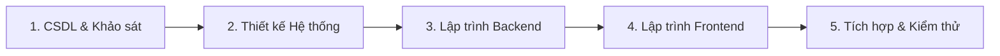

# KẾ HOẠCH PHÂN CÔNG NHIỆM VỤ & QUẢN LÝ DỰ ÁN (TASK ASSIGNMENTS)

> **Dự án**: Nền tảng Tìm bạn cùng thuê trọ và Ghép bạn trọ theo tiêu chí (Roommate Matching Hub)  
> **Mô hình đội ngũ**: **All-Dev Core Team** — Tất cả thành viên đều là Lập trình viên chính (Main Developers), trực tiếp tham gia lập trình và thực hiện mọi công đoạn.  
> **Cơ chế phân công**: Mỗi thành viên Lead (chịu trách nhiệm đầu mối) một mảng kỹ thuật cốt lõi, nhưng các nhiệm vụ nhỏ trong từng mảng đều được chia đều cho cả 3 bạn cùng làm. PM Leader giao việc trực tiếp vào file Markdown và đồng bộ lên GitHub.  

---

## 👥 1. CƠ CẤU NHÂN SỰ & TRÁCH NHIỆM ĐẦU MỐI (LEAD ROLES)

| Thành viên | MSSV | Vai trò chính | Mảng Kỹ Thuật Lead (Chịu trách nhiệm đầu mối) |
| :--- | :---: | :--- | :--- |
| **PM Leader (AI Lead)** | — | **Quản lý dự án & Điều phối kỹ thuật** | Lập kế hoạch SDLC, giao việc trực tiếp qua Markdown, review chất lượng code/docs, đồng bộ kho mã nguồn GitHub. |
| **Phạm Quốc Huy** | **24110226** | **Main Fullstack Developer** | **Lead mảng BA & Tài liệu (Requirements & Docs Lead)**: Định hướng phân tích nghiệp vụ, chuẩn hóa 54 FRs, thiết kế biểu mẫu, biên soạn báo cáo học thuật. |
| **Trần Quang Huy** | **24110228** | **Main Fullstack Developer** | **Lead mảng Kiến trúc kỹ thuật & Prototype (Technical Lead)**: Thiết kế kiến trúc tổng thể, cấu hình framework (Spring Boot 3, Flutter), giải quyết các rủi ro công nghệ. |
| **Phan Tiến Đạt** | **24110195** | **Main Fullstack Developer** | **Lead mảng Cơ sở dữ liệu & QA (Database & QA Lead)**: Thiết kế ERD, chuẩn hóa Schema MySQL, tối ưu truy vấn dữ liệu, lập kế hoạch kiểm thử hệ thống. |

---

## 🔄 2. QUY TRÌNH THỰC HIỆN THEO 5 GIAI ĐOẠN VÒNG ĐỜI (SDLC)

Toàn bộ nhóm 3 thành viên đều trực tiếp code và cùng nhau đi qua 5 giai đoạn khép kín:

---

## 📋 3. BẢNG PHÂN CÔNG NHIỆM VỤ CHI TIẾT THEO TỪNG CÔNG ĐOẠN

---

### GIAI ĐOẠN 1: KHỞI TẠO CƠ SỞ DỮ LIỆU & MÔ HÌNH HÓA YÊU CẦU

#### 🗄️ Công đoạn Cơ sở dữ liệu (Phan Tiến Đạt Lead)
*Cả 3 thành viên cùng trực tiếp tham gia xây dựng và cấu hình CSDL:*

| Mã Task | Nhiệm vụ chi tiết | Người phụ trách | Trạng thái | Sản phẩm đầu ra |
| :---: | :--- | :---: | :---: | :--- |
| **DB-01** | Thiết kế cấu trúc bảng DDL (`users`, `user_preferences`, `room_posts`, `match_requests`), khóa ngoại | **Phan Tiến Đạt (Lead)** | ✅ Hoàn thành | File `database/01_schema.sql` |
| **DB-02** | Xây dựng bộ dữ liệu mẫu khởi tạo (Seed Data: Admin, sinh viên, tiêu chí mẫu, bài đăng mẫu, mật khẩu hash) | **Phạm Quốc Huy** | ✅ Hoàn thành | File `database/02_seed_data.sql` |
| **DB-03** | Viết script tích hợp trọn gói 1-click & cấu hình kết nối `application.properties` trong Spring Boot | **Trần Quang Huy** | ✅ Hoàn thành | File `database/roommate_hub.sql` & config |
| **DB-04** | Viết tài liệu hướng dẫn cài đặt CSDL cho người dùng mới (CLI, DBeaver, Workbench) | **Phan Tiến Đạt** | ✅ Hoàn thành | File `database/README.md` |

#### 📑 Công đoạn Mô hình hóa yêu cầu & Báo cáo (Phạm Quốc Huy Lead)
*Cả 3 thành viên cùng tham gia phân tích và chuẩn bị dữ liệu báo cáo:*

| Mã Task | Nhiệm vụ chi tiết | Người phụ trách | Trạng thái | Sản phẩm đầu ra |
| :---: | :--- | :---: | :---: | :--- |
| **BA-01** | Khảo sát hiện trạng, phân tích đối thủ (Phongtro123, Facebook) & bảng hạn chế | **Phạm Quốc Huy (Lead)** | ✅ Hoàn thành | Phần 1 file `docs/Nhom13_Mohinhhoayeucau.docx` |
| **BA-02** | Đặc tả 54 yêu cầu chức năng (FR-01 → FR-54) theo 8 bộ phận kỹ thuật | **Phạm Quốc Huy (Lead)** | ✅ Hoàn thành | Phần 2 file `docs/Nhom13_Mohinhhoayeucau.docx` |
| **BA-03** | Thiết kế 5 biểu mẫu nghiệp vụ mẫu (QLTK_BM1, QLTC_BM1, QLBD_BM1, QLKN_BM1, QLLH_BM1) | **Phạm Quốc Huy** | ✅ Hoàn thành | Khung Mockup trong báo cáo |
| **BA-04** | Cung cấp thông số kỹ thuật phi chức năng (NFRs) về bảo mật BCrypt, JWT, hiệu năng API | **Trần Quang Huy** | ✅ Hoàn thành | Bảng NFRs trong Phần 2 báo cáo |
| **BA-05** | Xác định ma trận tác nhân (Actors) và dữ liệu các trường thực thể CSDL | **Phan Tiến Đạt** | ✅ Hoàn thành | Phần 3 trong báo cáo |
| **BA-06** | Xây dựng 7 bảng Đặc tả Use Case chi tiết (Luồng chính, luồng ngoại lệ, BR-01 → BR-07) | **Phạm Quốc Huy** | ✅ Hoàn thành | Phần 4 trong báo cáo |
| **BA-07** | Xuất và định dạng file Word hoàn chỉnh chuẩn đồ án đại học kèm trang bìa | **PM Leader** | ✅ Hoàn thành | File `docs/Nhom13_Mohinhhoayeucau.docx` |

#### 💻 Công đoạn Thiết lập Môi trường & Khung Prototype (Trần Quang Huy Lead)

| Mã Task | Nhiệm vụ chi tiết | Người phụ trách | Trạng thái | Sản phẩm đầu ra |
| :---: | :--- | :---: | :---: | :--- |
| **PR-01** | Khởi tạo khung Spring Boot 3 (Maven, Java 21, Spring Data JPA, Security) | **Trần Quang Huy (Lead)** | ✅ Hoàn thành | Thư mục `backend/` |
| **PR-02** | Khởi tạo khung ứng dụng Flutter (Dart 3.x, hỗ trợ Android/iOS/Web) | **Trần Quang Huy (Lead)** | ✅ Hoàn thành | Thư mục `frontend/` |
| **PR-03** | Khắc phục lỗi xung đột extension .NET / C# Dev Kit với file build Windows của Flutter | **Trần Quang Huy** | ✅ Hoàn thành | `.vscode/settings.json`, dọn dẹp `.sln` |
| **PR-04** | Cấu hình bảo mật kho Git, loại trừ thư mục AI nội bộ và đồng bộ lên GitHub | **PM Leader** | ✅ Hoàn thành | Git commit & push nhánh `master` |

---

### GIAI ĐOẠN 2: THIẾT KẾ HỆ THỐNG & CSDL NÂNG CAO (KẾ HOẠCH TIẾP THEO)
*Mục tiêu: Chuyển hóa yêu cầu thành thiết kế kiến trúc phần mềm và mở rộng Schema CSDL.*

| Mã Task | Nhiệm vụ chi tiết | Phân công phụ trách | Trạng thái |
| :---: | :--- | :---: | :---: |
| **DS-01** | Vẽ 6 Lược đồ Use Case phân hệ trên công cụ chuyên dụng (EA / StarUML) | **Phạm Quốc Huy (Lead)** | ⏳ Chuẩn bị |
| **DS-02** | Thiết kế Sơ đồ Tuần tự (Sequence Diagram) cho luồng Đăng nhập JWT & Thuật toán Matching | **Trần Quang Huy** | ⏳ Chuẩn bị |
| **DS-03** | Thiết kế Sơ đồ Lớp thực thể chi tiết (Class Diagram: Controller, Service, Repository, Entity) | **Phan Tiến Đạt** | ⏳ Chuẩn bị |
| **DS-04** | Thiết kế bổ sung các bảng CSDL mới: `viewing_appointments`, `contact_permissions`, `reports` | **Phan Tiến Đạt (Lead)** | ⏳ Chuẩn bị |
| **DS-05** | Thiết kế tài liệu đặc tả danh sách RESTful APIs (Swagger / OpenAPI) cho toàn hệ thống | **Trần Quang Huy (Lead)** | ⏳ Chuẩn bị |
| **DS-06** | Viết phần thuyết minh thiết kế kiến trúc hệ thống đưa vào báo cáo giai đoạn 2 | **Phạm Quốc Huy** | ⏳ Chuẩn bị |
| **DS-07** | Review và kiểm tra tính nhất quán giữa bản vẽ thiết kế và cấu trúc mã nguồn | **PM Leader** | ⏳ Chuẩn bị |

---

### GIAI ĐOẠN 3: LẬP TRÌNH BACKEND SPRING BOOT (CẢ 3 THÀNH VIÊN TRỰC TIẾP CODE)
*Mục tiêu: Chia đều các phân hệ Backend API cho cả 3 bạn cùng phát triển song song.*

| Mã Task | Phân hệ Backend phân công | Thành viên phụ trách chính | Công việc cụ thể |
| :---: | :--- | :---: | :--- |
| **BE-01** | **Module Auth, User & Security** | **Trần Quang Huy (Lead kỹ thuật)** | Viết `AuthController`, cấu hình `SecurityConfig`, `JwtUtils`, mã hóa BCrypt, đăng ký gửi mã OTP, đổi mật khẩu. |
| **BE-02** | **Lõi thuật toán Matching Engine** | **Trần Quang Huy** | Lập trình `MatchingService.java`, thuật toán tính điểm tương thích % theo trọng số, xử lý bộ lọc Hard Criteria & Soft Criteria. |
| **BE-03** | **Module Khảo sát Tiêu chí (UserPreference)** | **Phạm Quốc Huy** | Lập trình `ProfileController`, `UserPreferenceService`, các DTOs khảo sát 5 chiều, lưu trữ và cập nhật tiêu chí lối sống. |
| **BE-04** | **Module Quản trị Hệ thống (Admin)** | **Phạm Quốc Huy** | Lập trình `AdminController`, `AdminService`: API danh sách người dùng, khóa/mở khóa tài khoản, duyệt bài đăng, ẩn bài vi phạm. |
| **BE-05** | **Module Bài đăng phòng trọ (RoomPost)** | **Phan Tiến Đạt** | Lập trình `RoomPostController`, `RoomPostService`: API đăng tin tìm bạn ở ghép, tìm kiếm lọc phòng, đóng bài, xem chi tiết. |
| **BE-06** | **Module Ghép đôi & Lịch hẹn xem phòng** | **Phan Tiến Đạt** | Lập trình `MatchRequestController`: Quy trình Double Opt-in (Pending -> Accepted/Rejected), API đề xuất và xác nhận lịch hẹn xem trọ. |
| **BE-07** | **Kiểm thử tự động API (Unit & Integration Test)** | **Phan Tiến Đạt (Lead QA)** | Viết kịch bản kiểm thử JUnit 5 & Mockito cho Matching Service, Auth Service và Match Request. |
| **BE-08** | **Review mã nguồn Backend & CORS Policy** | **PM Leader** | Review code theo tiêu chuẩn Clean Code, SOLID, kiểm tra kết nối CSDL và xử lý ngoại lệ toàn cục (Global Exception Handler). |

---

### GIAI ĐOẠN 4: LẬP TRÌNH FRONTEND FLUTTER CLIENT (CẢ 3 THÀNH VIÊN TRỰC TIẾP CODE)
*Mục tiêu: Chia đều các màn hình giao diện di động/web cho cả 3 bạn cùng lập trình.*

| Mã Task | Phân hệ Giao diện Flutter phân công | Thành viên phụ trách chính | Công việc cụ thể |
| :---: | :--- | :---: | :--- |
| **FE-01** | **Kiến trúc Frontend & Network Service** | **Trần Quang Huy (Lead kỹ thuật)** | Cấu hình State Management (Provider/Bloc), định tuyến (Router), viết `ApiService` tích hợp gọi REST API Backend kèm JWT. |
| **FE-02** | **Giao diện Xác thực & Khám phá Matching** | **Trần Quang Huy** | Màn hình Đăng nhập, Đăng ký; Màn hình Khám phá (Feed gợi ý bạn cùng phòng kèm nhãn % tương thích, giải thích tiêu chí). |
| **FE-03** | **Giao diện Khảo sát tiêu chí lối sống 5 chiều** | **Phạm Quốc Huy** | Lập trình Form khảo sát trắc nghiệm trực quan (Slider ngân sách, Chips chọn giờ ngủ, độ sạch sẽ 1-5, thuốc lá, thú cưng). |
| **FE-04** | **Giao diện Hồ sơ cá nhân & Dashboard Admin** | **Phạm Quốc Huy** | Màn hình xem/sửa Profile, đổi mật khẩu; Màn hình Dashboard Admin duyệt bài đăng và quản lý người dùng vi phạm. |
| **FE-05** | **Giao diện Quản lý Bài đăng phòng trọ** | **Phan Tiến Đạt** | Màn hình Danh sách bài đăng phòng (Room Feed), Màn hình Chi tiết phòng trọ (Ảnh, giá, tiện ích), Form Đăng tin tìm bạn ở ghép. |
| **FE-06** | **Giao diện Yêu cầu ghép đôi & Lịch hẹn xem phòng** | **Phan Tiến Đạt** | Màn hình Yêu cầu kết nối (Tab Đã gửi / Đã nhận), Màn hình Lịch hẹn xem phòng (Xem lịch, xác nhận, nhắc nhở). |
| **FE-07** | **Kiểm thử giao diện người dùng (UI/UX Testing)** | **Phan Tiến Đạt (Lead QA)** | Kiểm thử độ phản hồi giao diện trên Web (Chrome/Edge) và Máy ảo Android Emulator, báo cáo các lỗi hiển thị. |
| **FE-08** | **Biên soạn Hướng dẫn sử dụng ứng dụng** | **Phạm Quốc Huy** | Chụp ảnh màn hình các luồng chính và viết tài liệu User Guide cho người dùng cuối. |

---

### GIAI ĐOẠN 5: TÍCH HỢP, KIỂM THỬ TOÀN DIỆN & ĐÓNG GÓI ĐỒ ÁN

| Mã Task | Nội dung công việc tích hợp | Phân công phụ trách |
| :---: | :--- | :---: |
| **IN-01** | Tích hợp End-to-End toàn hệ thống (Frontend gọi Backend lưu vào CSDL MySQL) | **Cả 3 thành viên: Quang Huy, Quốc Huy, Tiến Đạt** |
| **IN-02** | Chuẩn bị kịch bản demo và nạp dữ liệu mẫu sinh động (Demo Data Seeding) | **Phan Tiến Đạt (Lead QA)** |
| **IN-03** | Tổng hợp báo cáo đồ án hoàn chỉnh cuối kỳ và chuẩn bị Slide thuyết trình | **Phạm Quốc Huy (Lead Docs)** |
| **IN-04** | Đóng gói sản phẩm, xuất bản ứng dụng (Build APK / Web Release) và quay video demo | **Trần Quang Huy (Lead Tech)** |
| **IN-05** | Đánh giá nghiệm thu tổng thể, chuẩn bị câu hỏi phản biện trước hội đồng chấm điểm | **PM Leader** |

---

## 📌 4. QUY TRÌNH LÀM VIỆC CỦA NHÓM

1. **Cơ chế nhận việc & báo cáo tiến độ**:
   - Mọi task đều được PM Leader theo dõi và cập nhật minh bạch tại file [TASK_ASSIGNMENTS.md](TASK_ASSIGNMENTS.md).
   - Khi hoàn thành bất kỳ task nào, thành viên cập nhật trạng thái `✅ Hoàn thành` kèm mô tả sản phẩm đầu ra.
2. **Quy tắc phối hợp Code**:
   - Trước khi bắt đầu viết code: Luôn chạy lệnh `git pull origin master` để đồng bộ những thay đổi mới nhất từ các bạn khác.
   - Khi hoàn thành module: Kiểm tra code chạy ổn định, không gây gãy luồng của người khác, sau đó commit và push lên GitHub.
   - Commit message ghi rõ: `feat(backend): ...`, `feat(frontend): ...`, `docs: ...`, `fix: ...`.
