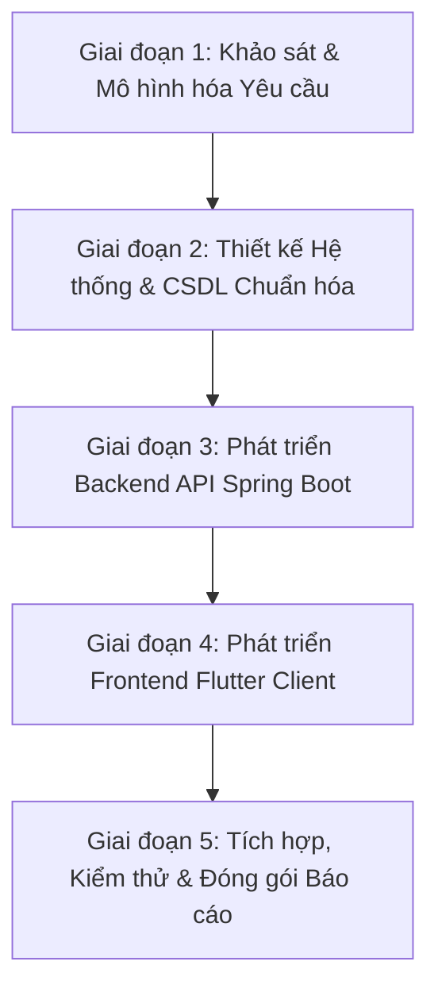

# KẾ HOẠCH PHÂN CÔNG NHIỆM VỤ & QUẢN LÝ DỰ ÁN (TASK ASSIGNMENTS)

> **Dự án**: Nền tảng Tìm bạn cùng thuê trọ và Ghép bạn trọ theo tiêu chí (Roommate Matching Hub)  
> **Mô hình quản lý**: Software Development Life Cycle (SDLC) theo từng giai đoạn vòng đời  
> **Cơ chế giao task**: PM Leader giao việc trực tiếp vào file Markdown và đồng bộ lên GitHub Repository  

---

## 👥 1. CƠ CẤU NHÂN SỰ & VAI TRÒ DỰ ÁN

| Thành viên | MSSV | Vai trò chính trong dự án | Trách nhiệm cốt lõi |
| :--- | :---: | :--- | :--- |
| **PM Leader (AI Lead)** | — | **Quản lý dự án & Kiến trúc kỹ thuật** | Lập kế hoạch, giao task trực tiếp qua Markdown, review code/docs, đồng bộ Git, đảm bảo tiến độ từng giai đoạn. |
| **Phạm Quốc Huy** | **24110226** | **Docs & Business Analyst (BA) Lead** | Phụ trách toàn bộ tài liệu dự án: Khảo sát hiện trạng, xác định 54 FRs, thiết kế biểu mẫu nghiệp vụ, báo cáo học thuật Word/PDF. |
| **Trần Quang Huy** | **24110228** | **Prototype & Technical Developer Lead** | Phụ trách mã nguồn mẫu thử (Prototype): Cấu hình môi trường Java 21, Spring Boot 3, Flutter mobile/web, giải quyết lỗi kỹ thuật (.NET, Maven). |
| **Phan Tiến Đạt** | **24110195** | **Database & Quality Assurance (QA) Lead** | Phụ trách thiết kế cơ sở dữ liệu MySQL, xây dựng kịch bản kiểm thử (Test Cases), đối soát luồng dữ liệu giữa Backend và Frontend. |

---

## 🔄 2. LỘ TRÌNH THỰC HIỆN THEO VÒNG ĐỜI DỰ ÁN (SDLC PHASES)

Toàn bộ nhóm làm việc cộng tác chặt chẽ theo từng giai đoạn khép kín:

---

## 📋 3. BẢNG PHÂN CÔNG NHIỆM VỤ CHI TIẾT (TASK BREAKDOWN)

### GIAI ĐOẠN 1: KHẢO SÁT & MÔ HÌNH HÓA YÊU CẦU (HIỆN TẠI)
*Mục tiêu: Hoàn tất tài liệu phân tích nghiệp vụ, chốt 54 yêu cầu chức năng (FRs) và báo cáo nộp giảng viên.*

| Mã Task | Nhiệm vụ chi tiết | Người phụ trách | Trạng thái | Sản phẩm đầu ra (Deliverables) |
| :---: | :--- | :---: | :---: | :--- |
| **T1.1** | Biên soạn báo cáo mô hình hóa yêu cầu theo 4 mẫu của GV | **Phạm Quốc Huy** | ✅ **Hoàn thành** | File `docs/Nhom13_Mohinhhoayeucau.docx` (155 đoạn, 29 bảng) |
| **T1.2** | Chuẩn hóa 54 yêu cầu chức năng (FR-01 → FR-54) & Ma trận Traceability | **Phạm Quốc Huy** | ✅ **Hoàn thành** | Bảng phân loại 8 bộ phận & Ma trận truy vết trong báo cáo |
| **T1.3** | Xây dựng 5 biểu mẫu nghiệp vụ mẫu (Mockup Text Templates) | **Phạm Quốc Huy** | ✅ **Hoàn thành** | Các mẫu `QLTK_BM1`, `QLTC_BM1`, `QLBD_BM1`, `QLKN_BM1`, `QLLH_BM1` |
| **T1.4** | Thiết lập bộ khung Prototype Backend (Spring Boot 3) & Frontend (Flutter) | **Trần Quang Huy** | ✅ **Hoàn thành** | Khung mã nguồn thư mục `backend/` và `frontend/` |
| **T1.5** | Xử lý triệt để xung đột môi trường (.NET vs Flutter build, Java 21) | **Trần Quang Huy** | ✅ **Hoàn thành** | Cấu hình `.vscode/settings.json`, dọn dẹp file `.sln` rác |
| **T1.6** | Phân rã và module hóa CSDL MySQL ra thư mục `database/` | **Phan Tiến Đạt** | ✅ **Hoàn thành** | `01_schema.sql`, `02_seed_data.sql`, `roommate_hub.sql` |
| **T1.7** | Quản lý kho mã nguồn, cấu hình `.gitignore` bảo mật và push GitHub | **PM Leader** | ✅ **Hoàn thành** | Nhánh `master` trên GitHub, bảo vệ an toàn thư mục AI |

---

### GIAI ĐOẠN 2: THIẾT KẾ KIẾN TRÚC & CSDL CHI TIẾT (TIẾP THEO)
*Mục tiêu: Chuyển hóa 54 yêu cầu thành sơ đồ thiết kế phần mềm (UML) và tối ưu hóa Schema Database.*

| Mã Task | Nhiệm vụ chi tiết | Người phụ trách | Hạn chót (Deadline) | Trạng thái |
| :---: | :--- | :---: | :---: | :---: |
| **T2.1** | Vẽ 6 lược đồ Use Case phân hệ trên Enterprise Architect / StarUML | **Phạm Quốc Huy** | Tuần tiếp theo | ⏳ Chuẩn bị làm |
| **T2.2** | Thiết kế Sơ đồ lớp chi tiết (Class Diagram) & Sơ đồ tuần tự (Sequence Diagram) | **Phạm Quốc Huy** | Tuần tiếp theo | ⏳ Chuẩn bị làm |
| **T2.3** | Bổ sung các bảng CSDL mới theo Chương 6: `ViewingAppointment`, `ContactPermission`, `Report` | **Phan Tiến Đạt** | Tuần tiếp theo | ⏳ Chuẩn bị làm |
| **T2.4** | Thiết lập quan hệ khóa ngoại (Foreign Keys) và ràng buộc toàn vẹn dữ liệu | **Phan Tiến Đạt** | Tuần tiếp theo | ⏳ Chuẩn bị làm |
| **T2.5** | Thiết kế tài liệu Swagger / OpenAPI đặc tả danh sách REST API endpoints | **Trần Quang Huy** | Tuần tiếp theo | ⏳ Chuẩn bị làm |
| **T2.6** | Review thiết kế kiến trúc, đảm bảo tuân thủ nguyên tắc SOLID và Clean Architecture | **PM Leader** | Tuần tiếp theo | ⏳ Chuẩn bị làm |

---

### GIAI ĐOẠN 3: PHÁT TRIỂN BACKEND API (SPRING BOOT 3)
*Mục tiêu: Hiện thực hóa logic nghiệp vụ, thuật toán Matching và bảo mật JWT.*

| Mã Task | Nhiệm vụ chi tiết | Người phụ trách | Hạn chót | Trạng thái |
| :---: | :--- | :---: | :---: | :---: |
| **T3.1** | Hoàn thiện Module Auth & User: Đăng ký OTP, Đổi mật khẩu, Xác minh email | **Trần Quang Huy** | Giai đoạn 3 | ⏳ Hàng đợi |
| **T3.2** | Cài đặt thuật toán Matching đa tiêu chí có trọng số (Matching Score Algorithm) | **Trần Quang Huy** | Giai đoạn 3 | ⏳ Hàng đợi |
| **T3.3** | Hiện thực hóa quy trình Double Opt-in: Match Request, Auto-expire sau 7 ngày | **Trần Quang Huy** | Giai đoạn 3 | ⏳ Hàng đợi |
| **T3.4** | Xây dựng API Lịch hẹn xem phòng trọ (`/api/v1/appointments`) | **Trần Quang Huy** | Giai đoạn 3 | ⏳ Hàng đợi |
| **T3.5** | Viết kịch bản kiểm thử API tự động (JUnit 5 & Mockito) cho Matching Service | **Phan Tiến Đạt** | Giai đoạn 3 | ⏳ Hàng đợi |
| **T3.6** | Kiểm tra bảo mật phân quyền Role (ROLE_USER, ROLE_ADMIN) và CORS Policy | **PM Leader** | Giai đoạn 3 | ⏳ Hàng đợi |

---

### GIAI ĐOẠN 4: PHÁT TRIỂN FRONTEND CLIENT (FLUTTER)
*Mục tiêu: Xây dựng giao diện di động & web mượt mà, trực quan, thân thiện với sinh viên.*

| Mã Task | Nhiệm vụ chi tiết | Người phụ trách | Hạn chót | Trạng thái |
| :---: | :--- | :---: | :---: | :---: |
| **T4.1** | Thiết kế UI Màn hình Khảo sát tiêu chí lối sống 5 chiều (Slider & Chips) | **Trần Quang Huy** | Giai đoạn 4 | ⏳ Hàng đợi |
| **T4.2** | Thiết kế UI Màn hình Khám phá & Gợi ý bạn trọ (Thẻ % tương thích) | **Trần Quang Huy** | Giai đoạn 4 | ⏳ Hàng đợi |
| **T4.3** | Thiết kế UI Bảng so sánh 2–3 hồ sơ ứng viên đối đầu (Comparison View) | **Trần Quang Huy** | Giai đoạn 4 | ⏳ Hàng đợi |
| **T4.4** | Thiết kế UI Quản lý Yêu cầu ghép đôi (Tab Đã gửi / Đã nhận) & Lịch hẹn xem phòng | **Trần Quang Huy** | Giai đoạn 4 | ⏳ Hàng đợi |
| **T4.5** | Xây dựng kịch bản kiểm thử giao diện (UI/UX Testing) trên máy ảo Android và Web | **Phan Tiến Đạt** | Giai đoạn 4 | ⏳ Hàng đợi |
| **T4.6** | Rà soát giao diện và tài liệu hướng dẫn sử dụng cho người dùng cuối | **Phạm Quốc Huy** | Giai đoạn 4 | ⏳ Hàng đợi |

---

### GIAI ĐOẠN 5: TÍCH HỢP, KIỂM THỬ VÀ BẢO VỆ ĐỒ ÁN
*Mục tiêu: Đóng gói toàn diện sản phẩm, quay video demo và hoàn thiện báo cáo tổng kết.*

| Mã Task | Nhiệm vụ chi tiết | Người phụ trách | Hạn chót | Trạng thái |
| :---: | :--- | :---: | :---: | :---: |
| **T5.1** | Tích hợp End-to-End giữa Frontend Flutter và Backend Spring Boot | Cả nhóm | Giai đoạn 5 | ⏳ Hàng đợi |
| **T5.2** | Tổng hợp báo cáo tổng kết cuối kỳ hoàn chỉnh (Word & Slide thuyết trình) | **Phạm Quốc Huy** | Giai đoạn 5 | ⏳ Hàng đợi |
| **T5.3** | Chuẩn bị dữ liệu mẫu trình diễn (Demo Data Seeding) và kịch bản demo | **Phan Tiến Đạt** | Giai đoạn 5 | ⏳ Hàng đợi |
| **T5.4** | Triển khai thử nghiệm (Deploy) và quay video giới thiệu sản phẩm | **Trần Quang Huy** | Giai đoạn 5 | ⏳ Hàng đợi |
| **T5.5** | Đánh giá tổng thể chất lượng đồ án trước khi nộp hội đồng chấm điểm | **PM Leader** | Giai đoạn 5 | ⏳ Hàng đợi |

---

## 📌 4. QUY TRÌNH LÀM VIỆC & QUẢN LÝ MÃ NGUỒN GITHUB

1. **Giao task & Báo cáo tiến độ**:
   - Mọi nhiệm vụ mới hoặc thay đổi trạng thái task sẽ được PM Leader cập nhật trực tiếp vào file `TASK_ASSIGNMENTS.md`.
   - Các thành viên theo dõi bảng này để nắm rõ deadline và yêu cầu kỹ thuật của phần việc mình phụ trách.
2. **Quy chuẩn Commit Git**:
   - Đặt commit message rõ ràng theo chuẩn Conventional Commits:
     - `feat:` Khi thêm chức năng mới.
     - `fix:` Khi sửa lỗi.
     - `docs:` Khi cập nhật tài liệu báo cáo.
     - `refactor:` Khi cấu trúc lại mã nguồn hoặc CSDL.
3. **Đồng bộ mã nguồn**:
   - Trước khi code: Chạy `git pull origin master` để lấy code mới nhất.
   - Sau khi hoàn thành task: Chạy kiểm thử, cập nhật trạng thái trong `TASK_ASSIGNMENTS.md` và push lên GitHub.
