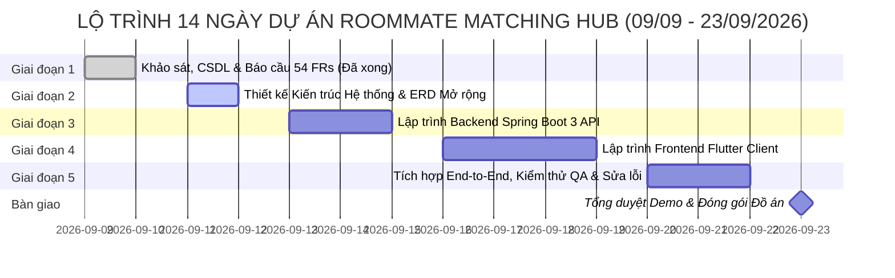

# KẾ HOẠCH PHÂN CÔNG NHIỆM VỤ & TIẾN ĐỘ DỰ ÁN (TASK ASSIGNMENTS & MASTER SCHEDULE)

> **Dự án**: Nền tảng Tìm bạn cùng thuê trọ và Ghép bạn trọ theo tiêu chí (Roommate Matching Hub)  
> **Thời gian thực hiện**: **Từ ngày 09/09/2026 đến ngày 23/09/2026** (Tổng thời gian: **14 ngày / 2 tuần**)  
> **HẠN CHÓT BÀN GIAO TOÀN DIỆN (HARD DEADLINE)**: ⏰ **18:00 Thứ Tư, ngày 23/09/2026**  
> **Mô hình đội ngũ**: **All-Dev Core Team** — Cả 3 thành viên (**Quốc Huy, Quang Huy, Tiến Đạt**) đều là Lập trình viên chính (Main Developers), trực tiếp tham gia viết mã nguồn và thực hiện mọi công đoạn SDLC.  

---

## 📅 1. BẢNG TIẾN ĐỘ TỔNG THỂ & CỘT MỐC DEADLINE (MASTER SCHEDULE)

| Cột mốc (Milestone) | Giai đoạn thực hiện | Thời gian bắt đầu | Hạn chót (Deadline) | Trọng tâm bàn giao (Deliverables) | Trạng thái |
| :---: | :--- | :---: | :---: | :--- | :---: |
| **Mốc 1** | **Giai đoạn 1: CSDL & Báo cáo Yêu cầu** | 09/09/2026 | **23:59 10/09/2026** | File Word `Nhom13_Mohinhhoayeucau.docx` (54 FRs), CSDL `database/`, Prototype framework. | ✅ **HOÀN THÀNH** |
| **Mốc 2** | **Giai đoạn 2: Thiết kế Hệ thống & ERD** | 11/09/2026 | **23:59 12/09/2026** | 6 Lược đồ Use Case, Sequence Diagram, Class Diagram, Bổ sung Schema CSDL (`appointments`, `reports`). | ⏳ **Đang tiến hành** |
| **Mốc 3** | **Giai đoạn 3: Lập trình Backend API** | 13/09/2026 | **23:59 15/09/2026** | REST APIs Spring Boot: Auth/JWT, Matching Engine, Double Opt-in, RoomPost, Lịch hẹn, Unit Tests. | ⏳ Hàng đợi |
| **Mốc 4** | **Giai đoạn 4: Lập trình Frontend Flutter** | 16/09/2026 | **23:59 19/09/2026** | Ứng dụng Flutter: UI Auth, Form khảo sát 5 chiều, Gợi ý % Matching, Quản lý bài đăng, Lịch hẹn xem trọ. | ⏳ Hàng đợi |
| **Mốc 5** | **Giai đoạn 5: Tích hợp E2E & Kiểm thử QA** | 20/09/2026 | **23:59 22/09/2026** | Tích hợp Frontend gọi Backend lưu MySQL, kiểm thử ngoại lệ, sửa lỗi toàn diện, nạp dữ liệu demo. | ⏳ Hàng đợi |
| **Mốc 6** | **Tổng duyệt & Đóng gói Hoàn thiện** | 23/09/2026 | ⏰ **18:00 23/09/2026** | Tổng duyệt demo luồng hoàn chỉnh, build APK/Web release, hoàn thiện Slide & Báo cáo đồ án. | 🎯 **HẠN CHÓT BÀN GIAO** |

---

## 👥 2. CƠ CẤU NHÂN SỰ & TRÁCH NHIỆM ĐẦU MỐI (LEAD ROLES)

| Thành viên | MSSV | Vai trò chính | Mảng Kỹ Thuật Lead (Chịu trách nhiệm đầu mối) | Trách nhiệm lập trình trực tiếp | Bảng Task Cá Nhân |
| :--- | :---: | :--- | :--- | :--- | :---: |
| **PM Leader (AI Lead)** | — | **Quản lý dự án & Kiến trúc** | Lập kế hoạch tiến độ đến 23/9, giao task trực tiếp qua Markdown, review code/docs, đồng bộ mã nguồn GitHub. | Điều phối chất lượng & quản lý rủi ro kỹ thuật. | — |
| **Phạm Quốc Huy** | **24110226** | **Main Fullstack Developer** | **Lead BA & Tài liệu (Requirements & Docs Lead)** | **Backend**: Module UserPreference & Admin. **Frontend**: UI Khảo sát 5 chiều & Profile. **Docs**: 54 FRs, UML Use Case, Báo cáo & Slide. | 👉 [**TASKS_QUOC_HUY.md**](TASKS_QUOC_HUY.md) |
| **Trần Quang Huy** | **24110228** | **Main Fullstack Developer** | **Lead Kiến trúc kỹ thuật & Prototype (Technical Lead)** | **Backend**: Module Auth/JWT & Lõi Matching Engine. **Frontend**: Kiến trúc Flutter, UI Auth & UI Khám phá bạn trọ. **DevOps**: Build release & Fix lỗi môi trường. | 👉 [**TASKS_QUANG_HUY.md**](TASKS_QUANG_HUY.md) |
| **Phan Tiến Đạt** | **24110195** | **Main Fullstack Developer** | **Lead Cơ sở dữ liệu & QA (Database & QA Lead)** | **Backend**: Module RoomPost & MatchRequest/Lịch hẹn. **Frontend**: UI Room Feed, Chi tiết phòng & Lịch hẹn xem trọ. **QA/DB**: Schema MySQL & Kịch bản Test tự động. | 👉 [**TASKS_TIEN_DAT.md**](TASKS_TIEN_DAT.md) |

> 💡 **Lưu ý dành cho thành viên**: Mỗi thành viên theo dõi bảng task cá nhân riêng của mình để cập nhật tiến độ, deadline từng giờ và tự tick vào checkbox `[x]` khi hoàn thành nhiệm vụ!

---

## 📋 3. BẢNG PHÂN CÔNG CÔNG VIỆC TỔNG HỢP THEO GIAI ĐOẠN

---

### GIAI ĐOẠN 1: CSDL & MÔ HÌNH HÓA YÊU CẦU (09/09 - 10/09/2026)
*Trạng thái: ✅ ĐÃ HOÀN THÀNH XUẤT SẮC NGÀY 09/09/2026*

| Mã Task | Tên công việc chi tiết | Phân công | Deadline | Trạng thái | Sản phẩm bàn giao |
| :---: | :--- | :---: | :---: | :---: | :--- |
| **T1.1** | Phân rã cấu trúc CSDL DDL (`01_schema.sql`) & Seed Data (`02_seed_data.sql`) | **Tiến Đạt & Quốc Huy** | 10/09/2026 | ✅ Xong | Thư mục `database/` chuẩn chỉ |
| **T1.2** | Biên soạn báo cáo `Nhom13_Mohinhhoayeucau.docx` theo 4 mẫu GV (54 FRs, 5 biểu mẫu, 7 đặc tả Use Case) | **Quốc Huy (Lead) & Cả nhóm** | 10/09/2026 | ✅ Xong | File `docs/Nhom13_Mohinhhoayeucau.docx` |
| **T1.3** | Cấu hình Prototype Backend Spring Boot 3 & Frontend Flutter, dọn dẹp lỗi .NET | **Quang Huy (Lead)** | 10/09/2026 | ✅ Xong | Thư mục `backend/` & `frontend/` |
| **T1.4** | Thiết lập Git Workflow, phân công task qua Markdown và đồng bộ GitHub | **PM Leader** | 10/09/2026 | ✅ Xong | Git commit & push nhánh `master` |

---

### GIAI ĐOẠN 2: THIẾT KẾ HỆ THỐNG & CSDL MỞ RỘNG (11/09 - 12/09/2026)
*Mục tiêu: Hoàn tất toàn bộ sơ đồ thiết kế kiến trúc và mở rộng CSDL MySQL.*  
*Deadline Giai đoạn 2: ⏰ **23:59 Thứ Sáu, 12/09/2026***

| Mã Task | Tên công việc chi tiết | Phân công | Deadline | Trạng thái | Sản phẩm bàn giao |
| :---: | :--- | :---: | :---: | :---: | :--- |
| **T2.1** | Vẽ 6 Lược đồ Use Case phân hệ trên Enterprise Architect / StarUML | **Phạm Quốc Huy (Lead)** | 12/09/2026 | ⏳ Đang làm | File ảnh sơ đồ xuất ra thư mục `docs/` |
| **T2.2** | Thiết kế Sơ đồ Tuần tự (Sequence Diagram) luồng Đăng nhập JWT & Thuật toán Matching | **Trần Quang Huy** | 12/09/2026 | ⏳ Đang làm | File sơ đồ tuần tự chi tiết |
| **T2.3** | Thiết kế Sơ đồ Lớp thực thể (Class Diagram: Entity, DTO, Repository, Service, Controller) | **Phan Tiến Đạt** | 12/09/2026 | ⏳ Đang làm | File sơ đồ lớp kiến trúc |
| **T2.4** | Bổ sung bảng CSDL mới: `viewing_appointments`, `contact_permissions`, `reports` | **Phan Tiến Đạt (Lead)** | 12/09/2026 | ⏳ Đang làm | File SQL cập nhật trong `database/` |
| **T2.5** | Đặc tả tài liệu danh sách REST APIs (Swagger / OpenAPI specifications) | **Trần Quang Huy (Lead)** | 12/09/2026 | ⏳ Đang làm | Tài liệu API contract |
| **T2.6** | Cập nhật các bản vẽ thiết kế vào tài liệu báo cáo giai đoạn 2 | **Phạm Quốc Huy** | 12/09/2026 | ⏳ Đang làm | File tài liệu thiết kế hệ thống |
| **T2.7** | Review kỹ thuật và kiểm tra tính tương thích giữa CSDL và Backend Entity | **PM Leader** | 12/09/2026 | ⏳ Đang làm | Biên bản kiểm duyệt thiết kế |

---

### GIAI ĐOẠN 3: LẬP TRÌNH HOÀN THIỆN BACKEND SPRING BOOT (13/09 - 15/09/2026)
*Mục tiêu: Hoàn thành 100% các REST APIs Backend có bảo mật JWT và Unit Test.*  
*Deadline Giai đoạn 3: ⏰ **23:59 Thứ Hai, 15/09/2026***

| Mã Task | Phân hệ Backend phân công | Phân công trực tiếp | Deadline | Trạng thái |
| :---: | :--- | :---: | :---: | :---: |
| **T3.1** | **Auth, User & Security**: Đăng ký, đăng nhập JWT, đổi mật khẩu, OTP email | **Trần Quang Huy (Lead)** | 14/09/2026 | ⏳ Hàng đợi |
| **T3.2** | **Lõi Matching Engine**: Thuật toán tính % tương thích có trọng số đa tiêu chí | **Trần Quang Huy** | 15/09/2026 | ⏳ Hàng đợi |
| **T3.3** | **Khảo sát Tiêu chí**: APIs lưu và cập nhật `UserPreference` 5 chiều | **Phạm Quốc Huy** | 14/09/2026 | ⏳ Hàng đợi |
| **T3.4** | **Quản trị Admin**: APIs quản lý tài khoản (khóa/mở) và duyệt bài đăng phòng | **Phạm Quốc Huy** | 15/09/2026 | ⏳ Hàng đợi |
| **T3.5** | **Bài đăng phòng trọ**: APIs tạo bài, duyệt bài, lọc tìm phòng, xem chi tiết | **Phan Tiến Đạt** | 14/09/2026 | ⏳ Hàng đợi |
| **T3.6** | **Ghép đôi & Lịch hẹn xem phòng**: Double Opt-in (Accept/Reject), đặt lịch hẹn xem trọ | **Phan Tiến Đạt** | 15/09/2026 | ⏳ Hàng đợi |
| **T3.7** | **Viết Unit Tests (JUnit 5 & Mockito)**: Kiểm thử tự động tính đúng đắn của Matching | **Phan Tiến Đạt (Lead QA)** | 15/09/2026 | ⏳ Hàng đợi |
| **T3.8** | **Kiểm thử tích hợp Postman & nghiệm thu Backend Milestone 3** | **PM Leader** | 15/09/2026 | ⏳ Hàng đợi |

---

### GIAI ĐOẠN 4: LẬP TRÌNH FRONTEND FLUTTER CLIENT (16/09 - 19/09/2026)
*Mục tiêu: Hoàn thành toàn bộ giao diện ứng dụng di động & web Flutter mượt mà, trực quan.*  
*Deadline Giai đoạn 4: ⏰ **23:59 Thứ Sáu, 19/09/2026***

| Mã Task | Phân hệ Giao diện Flutter | Phân công trực tiếp | Deadline | Trạng thái |
| :---: | :--- | :---: | :---: | :---: |
| **T4.1** | Cấu hình State Management (Provider), Routing, Network Service (`api_service.dart`) | **Trần Quang Huy (Lead)** | 16/09/2026 | ⏳ Hàng đợi |
| **T4.2** | UI Đăng nhập, Đăng ký & Màn hình Khám phá bạn trọ (Thẻ % tương thích) | **Trần Quang Huy** | 18/09/2026 | ⏳ Hàng đợi |
| **T4.3** | UI Bảng so sánh 2–3 hồ sơ ứng viên đối đầu trực quan (Comparison View) | **Trần Quang Huy** | 19/09/2026 | ⏳ Hàng đợi |
| **T4.4** | UI Form khảo sát tiêu chí lối sống 5 chiều (Sliders, Chips, Validation) | **Phạm Quốc Huy** | 17/09/2026 | ⏳ Hàng đợi |
| **T4.5** | UI Xem/Chỉnh sửa Profile cá nhân & Màn hình Dashboard Admin quản trị | **Phạm Quốc Huy** | 19/09/2026 | ⏳ Hàng đợi |
| **T4.6** | UI Feed Bài đăng phòng trọ, Màn hình Chi tiết phòng trọ & Form Đăng tin phòng | **Phan Tiến Đạt** | 18/09/2026 | ⏳ Hàng đợi |
| **T4.7** | UI Quản lý Yêu cầu ghép đôi (Tab Đã gửi / Đã nhận) & Quản lý lịch hẹn xem phòng | **Phan Tiến Đạt** | 19/09/2026 | ⏳ Hàng đợi |
| **T4.8** | Kiểm thử giao diện trên Android Emulator và Web, tối ưu trải nghiệm người dùng | **Tiến Đạt & PM Leader** | 19/09/2026 | ⏳ Hàng đợi |

---

### GIAI ĐOẠN 5: TÍCH HỢP TOÀN DIỆN (E2E), KIỂM THỬ QA & SỬA LỖI (20/09 - 22/09/2026)
*Mục tiêu: Đảm bảo toàn bộ luồng hoạt động thông suốt từ UI đến CSDL, sửa sạch lỗi.*  
*Deadline Giai đoạn 5: ⏰ **23:59 Thứ Hai, 22/09/2026***

| Mã Task | Nội dung công việc | Phân công | Deadline | Trạng thái |
| :---: | :--- | :---: | :---: | :---: |
| **T5.1** | Tích hợp End-to-End toàn diện: Khảo sát -> Tính điểm -> Gợi ý -> Ghép đôi -> Hẹn xem phòng | **Cả 3 thành viên** | 21/09/2026 | ⏳ Hàng đợi |
| **T5.2** | Chuẩn bị kịch bản demo và nạp dữ liệu mẫu sinh viên thực tế (Demo Data Seeding) | **Phan Tiến Đạt (Lead QA)** | 21/09/2026 | ⏳ Hàng đợi |
| **T5.3** | Rà soát lỗi ngoại lệ (Bug Fixing) và tối ưu hóa thời gian phản hồi API | **Trần Quang Huy & PM Lead** | 22/09/2026 | ⏳ Hàng đợi |
| **T5.4** | Hoàn thiện tài liệu Hướng dẫn sử dụng (User Guide) kèm hình ảnh chụp màn hình | **Phạm Quốc Huy** | 22/09/2026 | ⏳ Hàng đợi |
| **T5.5** | Soạn thảo bộ Slide PowerPoint thuyết trình bảo vệ đồ án trước hội đồng | **Phạm Quốc Huy & Cả nhóm** | 22/09/2026 | ⏳ Hàng đợi |

---

### GIAI ĐOẠN 6: TỔNG DUYỆT BẢO VỆ & ĐÓNG GÓI BÀN GIAO (NGÀY 23/09/2026)
*Mục tiêu: Hoàn thiện chỉn chu 100% mọi hạng mục, sẵn sàng nộp và bảo vệ đạt điểm tối đa.*  
*FINAL HARD DEADLINE: ⏰ **18:00 Thứ Tư, ngày 23/09/2026***

| Thời gian | Nội dung công việc ngày cuối cùng | Phân công | Trạng thái |
| :---: | :--- | :---: | :---: |
| **08:00 - 11:30** | Chạy thử nghiệm tổng duyệt toàn bộ kịch bản demo trên thiết bị thật và máy ảo | Cả nhóm (Quốc Huy, Quang Huy, Tiến Đạt, PM) | 🎯 Chờ thực hiện |
| **11:30 - 14:00** | Build đóng gói bản phát hành: File APK Android cài đặt & Web release hosting | **Trần Quang Huy** | 🎯 Chờ thực hiện |
| **14:00 - 16:30** | Rà soát toàn bộ tài liệu nộp: File Word báo cáo cuối kỳ, File slide thuyết trình | **Phạm Quốc Huy** | 🎯 Chờ thực hiện |
| **16:30 - 17:30** | Kiểm tra toàn bộ script CSDL MySQL sạch, sẵn sàng nạp cho Thầy/Cô chấm | **Phan Tiến Đạt** | 🎯 Chờ thực hiện |
| **17:30 - 18:00** | **TỔNG KẾT, ĐÓNG GÓI VÀ PUSH TOÀN BỘ REPO LÊN GITHUB BÀN GIAO CHÍNH THỨC** | **PM Leader & Cả nhóm** | 🎯 **BÀN GIAO** |

---

## 📌 4. NGUYÊN TẮC QUẢN LÝ TIẾN ĐỘ CỦA PM LEADER

1. **Tuân thủ mốc kiểm tra hàng ngày (Daily Check-in)**:
   - Cuối mỗi ngày làm việc, các thành viên cập nhật tiến độ task vào file `TASK_ASSIGNMENTS.md`.
   - Nếu bất kỳ task nào gặp nguy cơ chậm tiến độ (Blocker), báo ngay cho PM Leader để được hỗ trợ gỡ lỗi kịp thời, không để dồn việc sang ngày hôm sau.
2. **Kỷ luật Git Workflow**:
   - Mỗi task làm trên nhánh riêng, test kỹ trước khi tạo Pull Request vào `master`.
   - Tuyệt đối tuân thủ hướng dẫn tại [GIT_WORKFLOW.md](GIT_WORKFLOW.md).
